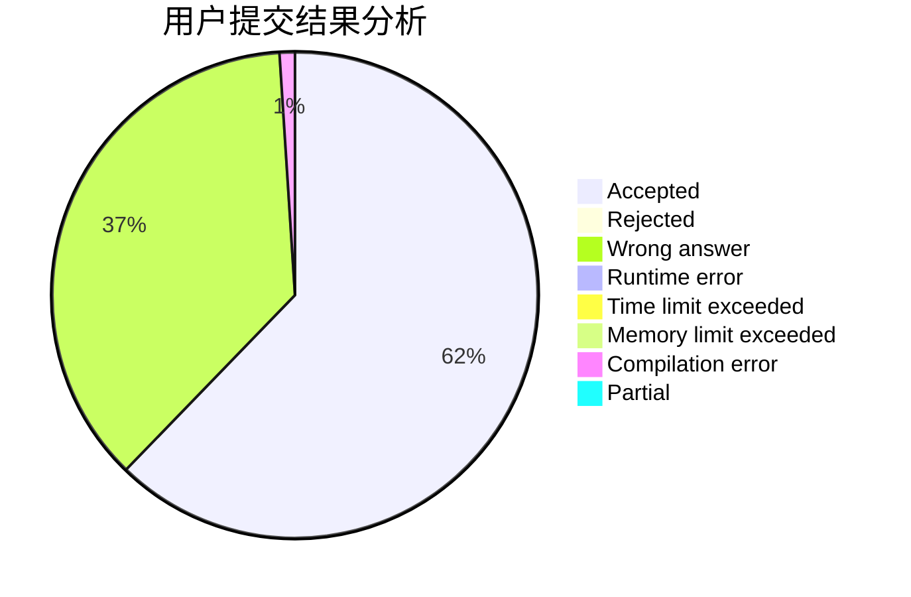
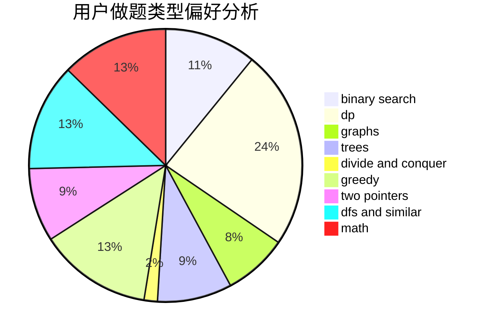

# yyyg

<!-- tabs:start -->

#### **用户提交结果分析**

#### **用户做题类型偏好分析**

<!-- tabs:end -->
# 推荐题目
[1301C](https://codeforces.com/contest/1301/problem/C)
[1059B](https://codeforces.com/contest/1059/problem/B)
[716B](https://codeforces.com/contest/716/problem/B)
[699C](https://codeforces.com/contest/699/problem/C)
[218C](https://codeforces.com/contest/218/problem/C)
[494E](https://codeforces.com/contest/494/problem/E)
[745C](https://codeforces.com/contest/745/problem/C)
[793G](https://codeforces.com/contest/793/problem/G)
[897C](https://codeforces.com/contest/897/problem/C)
[877B](https://codeforces.com/contest/877/problem/B)
