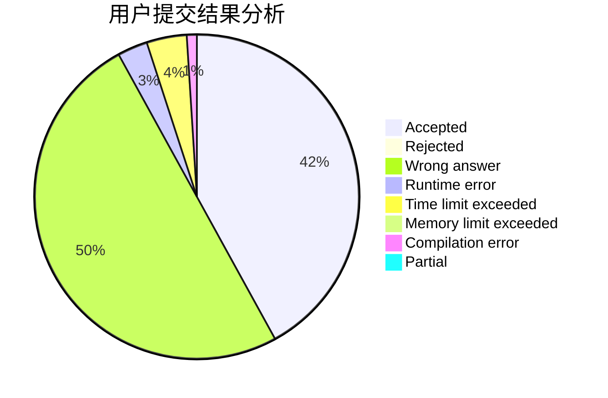
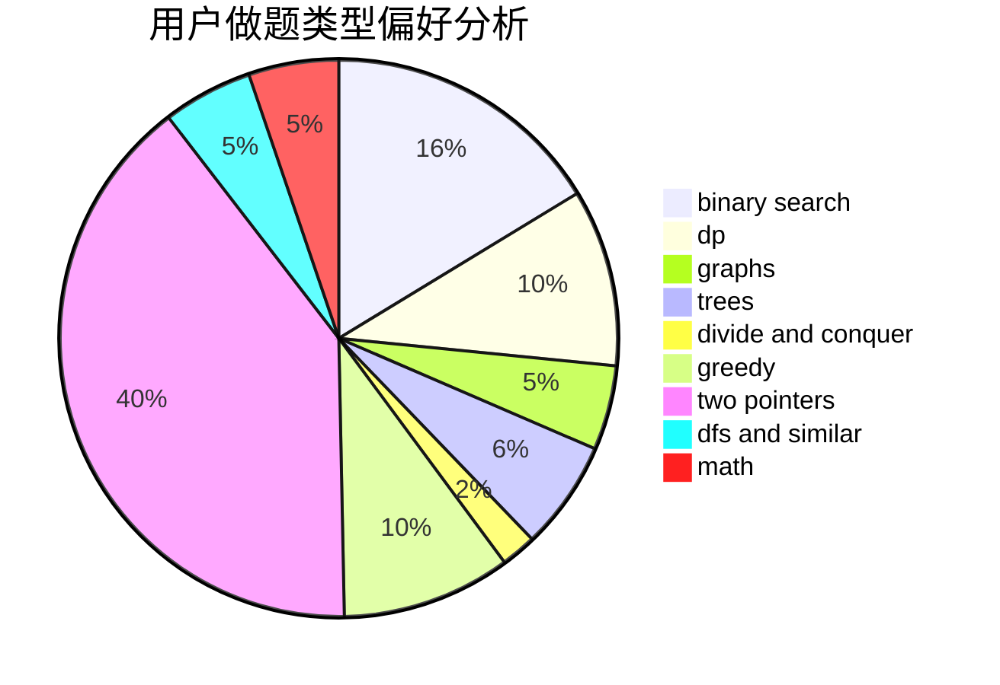

# CheBen

<!-- tabs:start -->

#### **用户提交结果分析**

#### **用户做题类型偏好分析**

<!-- tabs:end -->
# 推荐题目
[13131](https://codeforces.com/contest/1313/problem/1)
[1364A](https://codeforces.com/contest/1364/problem/A)
[13351](https://codeforces.com/contest/1335/problem/1)
[1423I](https://codeforces.com/contest/1423/problem/I)
[691C](https://codeforces.com/contest/691/problem/C)
[449D](https://codeforces.com/contest/449/problem/D)
[691D](https://codeforces.com/contest/691/problem/D)
[571C](https://codeforces.com/contest/571/problem/C)
[691E](https://codeforces.com/contest/691/problem/E)
[1364D](https://codeforces.com/contest/1364/problem/D)
