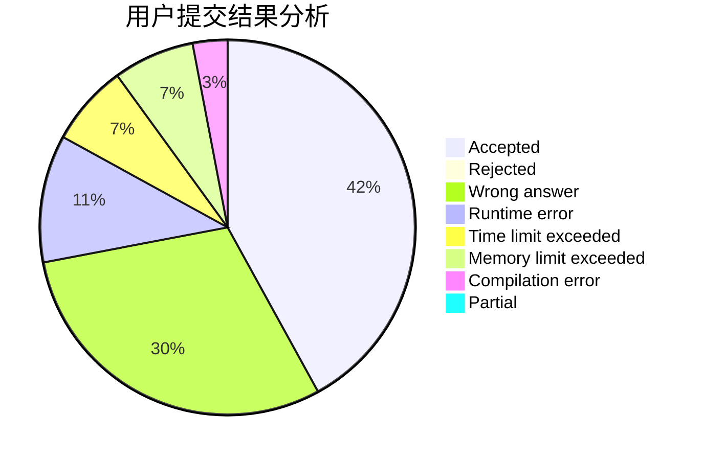
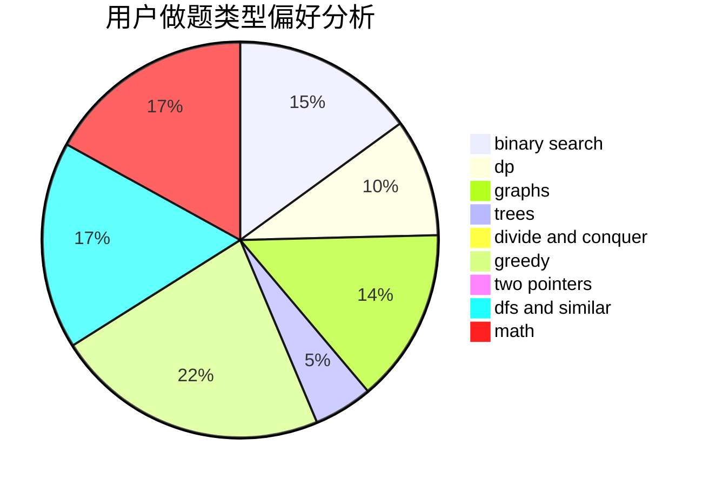

# yz6205

<!-- tabs:start -->

#### **用户提交结果分析**

#### **用户做题类型偏好分析**

<!-- tabs:end -->
# 推荐题目
[1203A](https://codeforces.com/contest/1203/problem/A)
[433B](https://codeforces.com/contest/433/problem/B)
[809C](https://codeforces.com/contest/809/problem/C)
[514C](https://codeforces.com/contest/514/problem/C)
[639B](https://codeforces.com/contest/639/problem/B)
[618A](https://codeforces.com/contest/618/problem/A)
[750G](https://codeforces.com/contest/750/problem/G)
[1086E](https://codeforces.com/contest/1086/problem/E)
[620D](https://codeforces.com/contest/620/problem/D)
[1250A](https://codeforces.com/contest/1250/problem/A)
