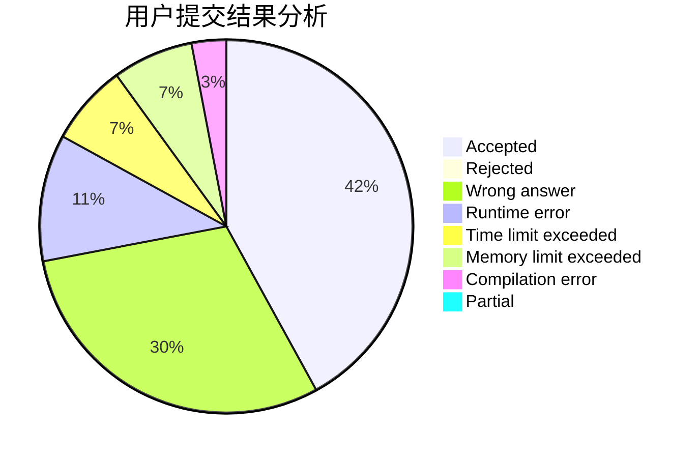
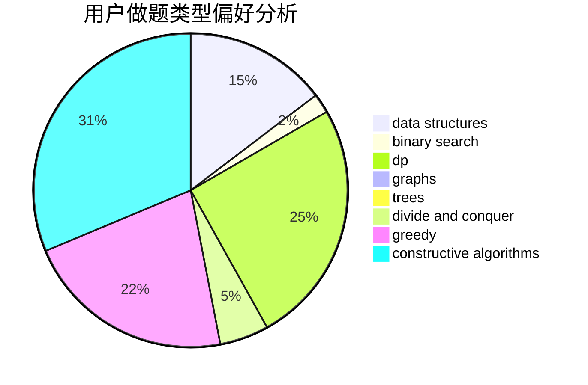
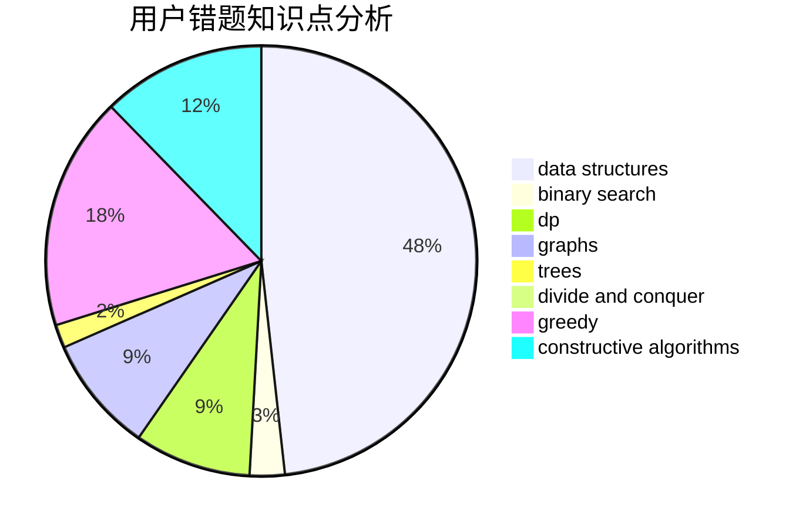

# yz6205

<!-- tabs:start -->

#### **用户提交结果分析**

#### **用户做题类型偏好分析**

#### **用户错题知识点分析**

<!-- tabs:end -->
# 推荐题目
[1199E](https://codeforces.com/contest/1199/problem/E)		dsu,graphs,sortings,trees		  
[404C](https://codeforces.com/contest/404/problem/C)		dfs and similar,
                        graphs,
                        sortings		  
[794B](https://codeforces.com/contest/794/problem/B)		geometry,
                        math		  
[494B](https://codeforces.com/contest/494/problem/B)		dp,
                        strings		  
[618D](https://codeforces.com/contest/618/problem/D)		dfs and similar,
                        dp,
                        graph matchings,
                        greedy,
                        trees		  
[599E](https://codeforces.com/contest/599/problem/E)		bitmasks,
                        dp,
                        trees		  
[733B](https://codeforces.com/contest/733/problem/B)		math		  
[1086B](https://codeforces.com/contest/1086/problem/B)		dsu,graphs,sortings,trees		  
[601B](https://codeforces.com/contest/601/problem/B)		data structures,
                        math		  
[1244F](https://codeforces.com/contest/1244/problem/F)		constructive algorithms,
                        implementation		  
