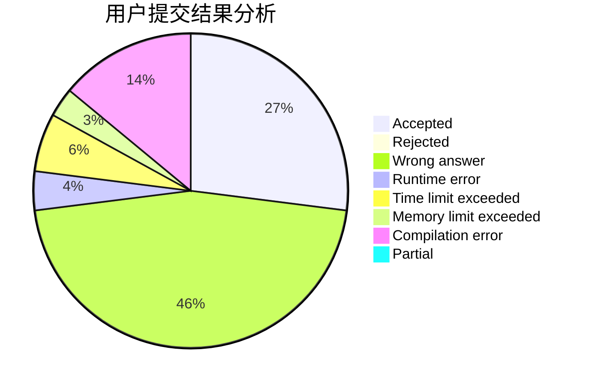
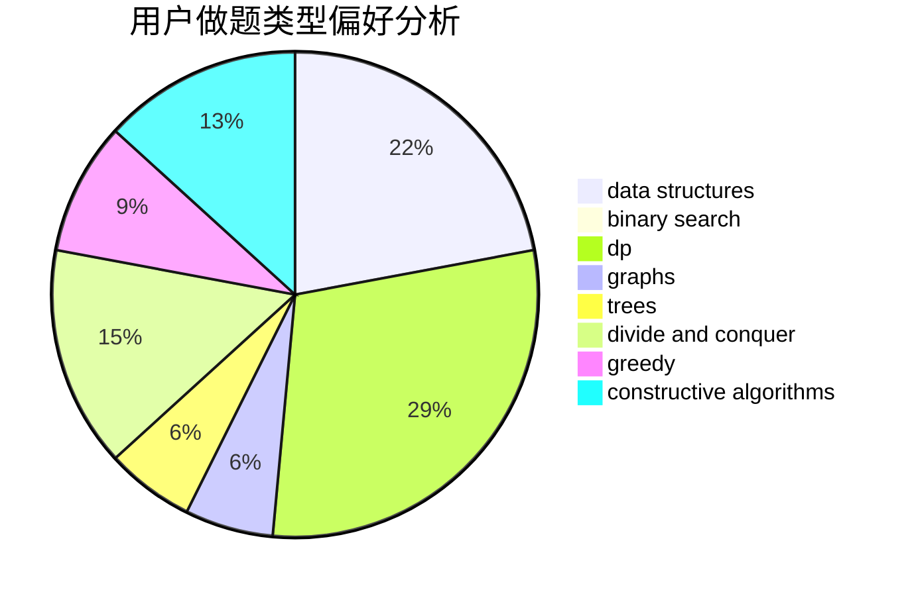
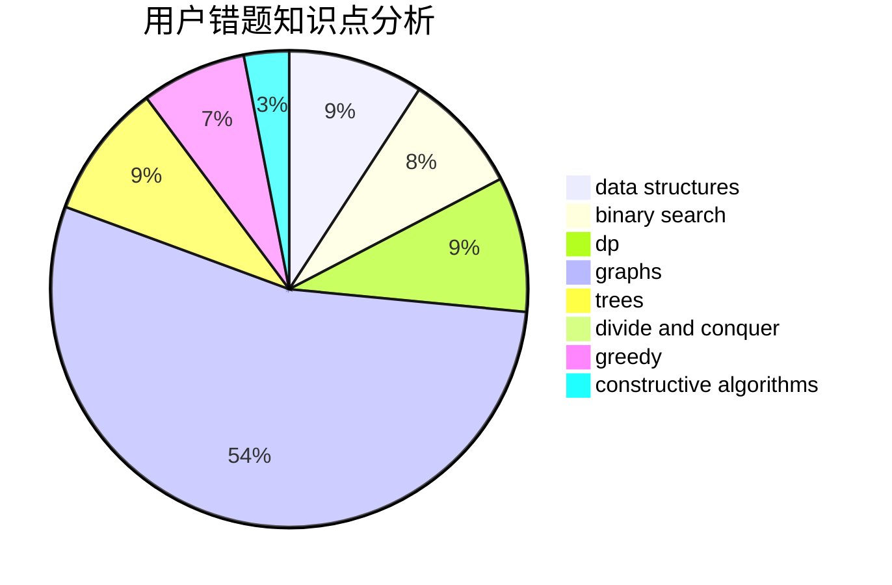

# yzc2005

<!-- tabs:start -->

#### **用户提交结果分析**

#### **用户做题类型偏好分析**

#### **用户错题知识点分析**

<!-- tabs:end -->
# 推荐题目
[1466G](https://codeforces.com/contest/1466/problem/G)		combinatorics,
                        divide and conquer,
                        hashing,
                        math,
                        string suffix structures,
                        strings		  
[516E](https://codeforces.com/contest/516/problem/E)		math,
                        number theory		  
[446E](https://codeforces.com/contest/446/problem/E)		math,
                        matrices		  
[667A](https://codeforces.com/contest/667/problem/A)		geometry,
                        math		  
[1002A4](https://codeforces.com/contest/1002A/problem/4)		nan		  
[918A](https://codeforces.com/contest/918/problem/A)		brute force,
                        implementation		  
[620E](https://codeforces.com/contest/620/problem/E)		bitmasks,
                        data structures,
                        trees		  
[280E](https://codeforces.com/contest/280/problem/E)		data structures,
                        dp,
                        implementation,
                        math		  
[258D](https://codeforces.com/contest/258/problem/D)		dp,
                        math,
                        probabilities		  
[95B](https://codeforces.com/contest/95/problem/B)		dp,
                        greedy		  
