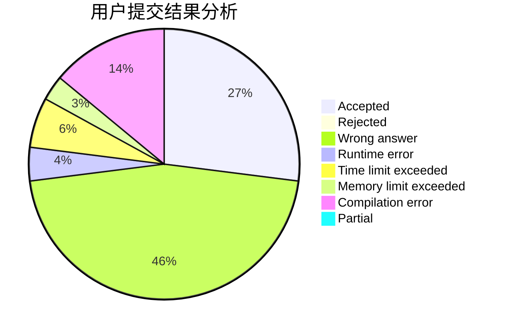
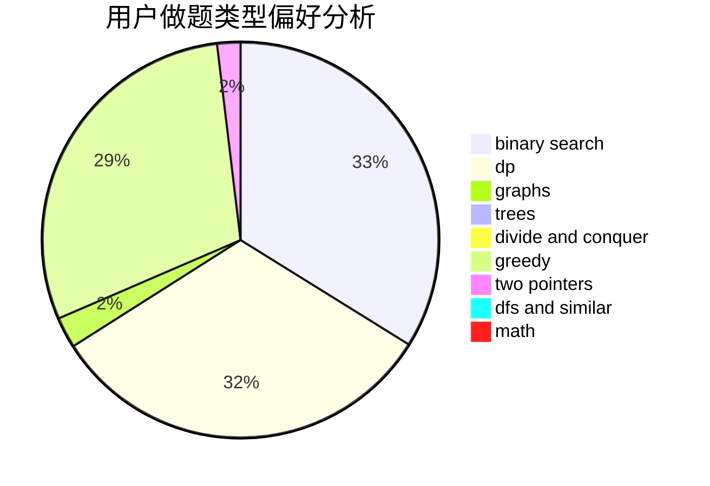

# yzc2005

<!-- tabs:start -->

#### **用户提交结果分析**

#### **用户做题类型偏好分析**

<!-- tabs:end -->
# 推荐题目
[1473G](https://codeforces.com/contest/1473/problem/G)
[543E](https://codeforces.com/contest/543/problem/E)
[467A](https://codeforces.com/contest/467/problem/A)
[689A](https://codeforces.com/contest/689/problem/A)
[10022](https://codeforces.com/contest/1002/problem/2)
[938D](https://codeforces.com/contest/938/problem/D)
[644A](https://codeforces.com/contest/644/problem/A)
[297B](https://codeforces.com/contest/297/problem/B)
[276C](https://codeforces.com/contest/276/problem/C)
[981F](https://codeforces.com/contest/981/problem/F)
