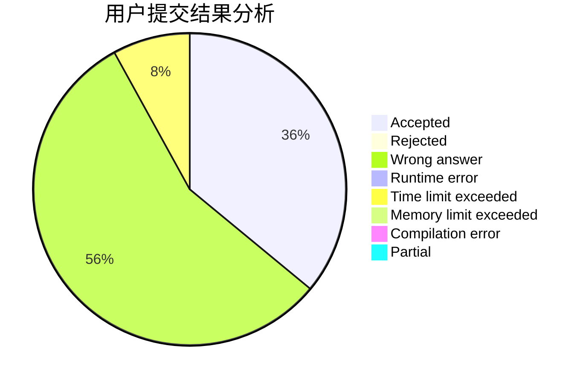
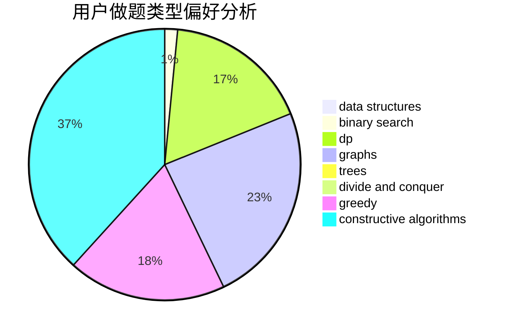
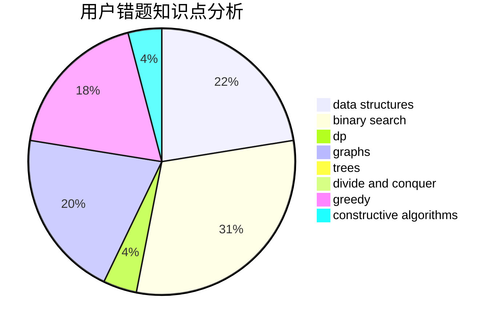

# yzhid

<!-- tabs:start -->

#### **用户提交结果分析**

#### **用户做题类型偏好分析**

#### **用户错题知识点分析**

<!-- tabs:end -->
# 推荐题目
[1166A](https://codeforces.com/contest/1166/problem/A)		combinatorics,
                        greedy		  
[674G](https://codeforces.com/contest/674/problem/G)		dsu,graphs,sortings,trees		  
[555E](https://codeforces.com/contest/555/problem/E)		dfs and similar,
                        graphs,
                        trees		  
[338D](https://codeforces.com/contest/338/problem/D)		chinese remainder theorem,
                        math,
                        number theory		  
[216B](https://codeforces.com/contest/216/problem/B)		dfs and similar,
                        implementation		  
[359D](https://codeforces.com/contest/359/problem/D)		binary search,
                        brute force,
                        data structures,
                        math,
                        two pointers		  
[677D](https://codeforces.com/contest/677/problem/D)		data structures,
                        dp,
                        graphs,
                        shortest paths		  
[439E](https://codeforces.com/contest/439/problem/E)		combinatorics,
                        dp,
                        math		  
[1227B](https://codeforces.com/contest/1227/problem/B)		constructive algorithms		  
[1110A](https://codeforces.com/contest/1110/problem/A)		math		  
