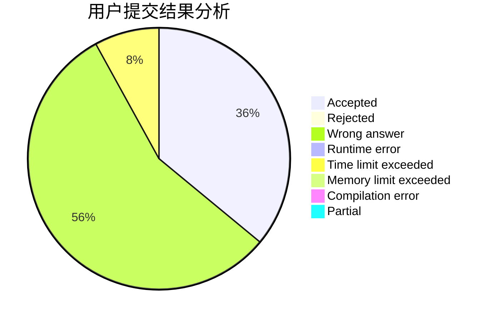
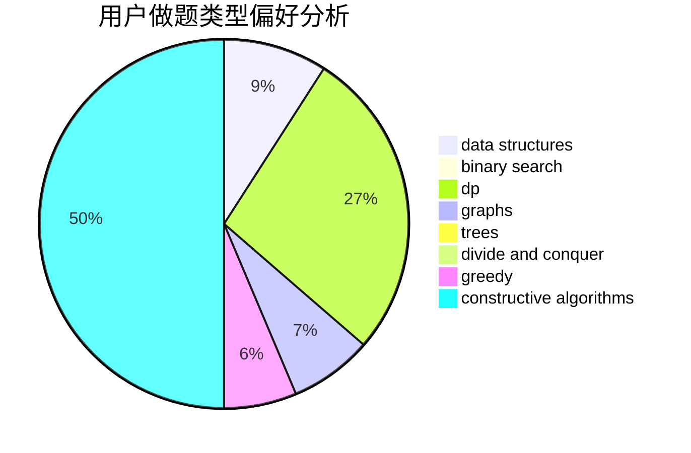
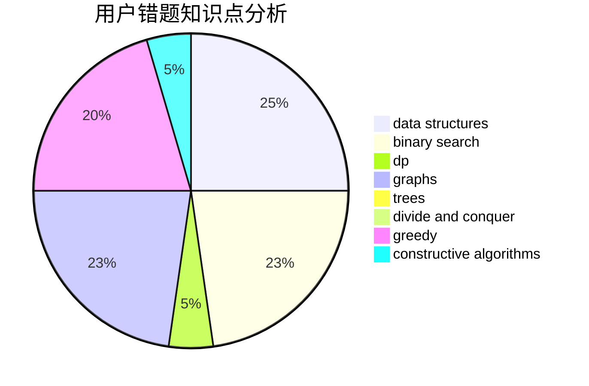

# yzhid

<!-- tabs:start -->

#### **用户提交结果分析**

#### **用户做题类型偏好分析**

#### **用户错题知识点分析**

<!-- tabs:end -->
# 推荐题目
[1168E](https://codeforces.com/contest/1168/problem/E)		constructive algorithms,
                        math		  
[699D](https://codeforces.com/contest/699/problem/D)		dsu,graphs,sortings,trees		  
[580B](https://codeforces.com/contest/580/problem/B)		binary search,
                        sortings,
                        two pointers		  
[364C](https://codeforces.com/contest/364/problem/C)		brute force,
                        number theory		  
[235D](https://codeforces.com/contest/235/problem/D)		graphs		  
[387C](https://codeforces.com/contest/387/problem/C)		greedy,
                        implementation		  
[701D](https://codeforces.com/contest/701/problem/D)		dsu,graphs,sortings,trees		  
[461A](https://codeforces.com/contest/461/problem/A)		greedy,
                        sortings		  
[1234F](https://codeforces.com/contest/1234/problem/F)		bitmasks,
                        dp		  
[1110D](https://codeforces.com/contest/1110/problem/D)		dp		  
