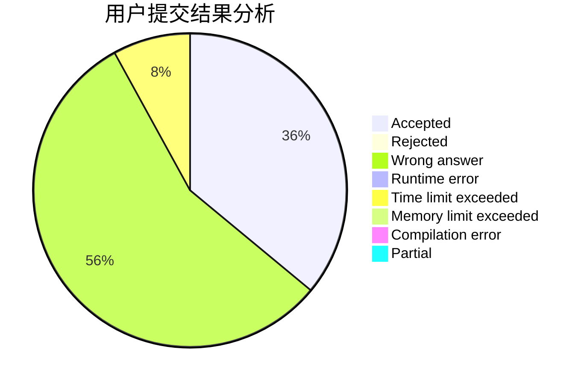
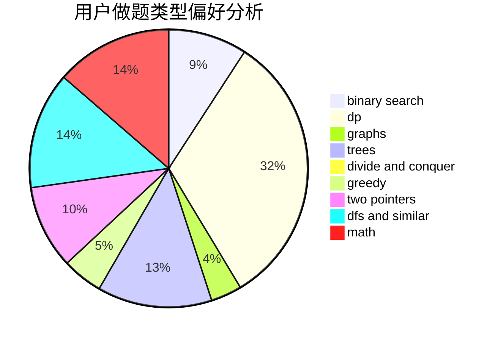

# yzhid

<!-- tabs:start -->

#### **用户提交结果分析**

#### **用户做题类型偏好分析**

<!-- tabs:end -->
# 推荐题目
[1168E](https://codeforces.com/contest/1168/problem/E)
[699D](https://codeforces.com/contest/699/problem/D)
[580B](https://codeforces.com/contest/580/problem/B)
[364C](https://codeforces.com/contest/364/problem/C)
[235D](https://codeforces.com/contest/235/problem/D)
[387C](https://codeforces.com/contest/387/problem/C)
[701D](https://codeforces.com/contest/701/problem/D)
[461A](https://codeforces.com/contest/461/problem/A)
[1234F](https://codeforces.com/contest/1234/problem/F)
[1110D](https://codeforces.com/contest/1110/problem/D)
