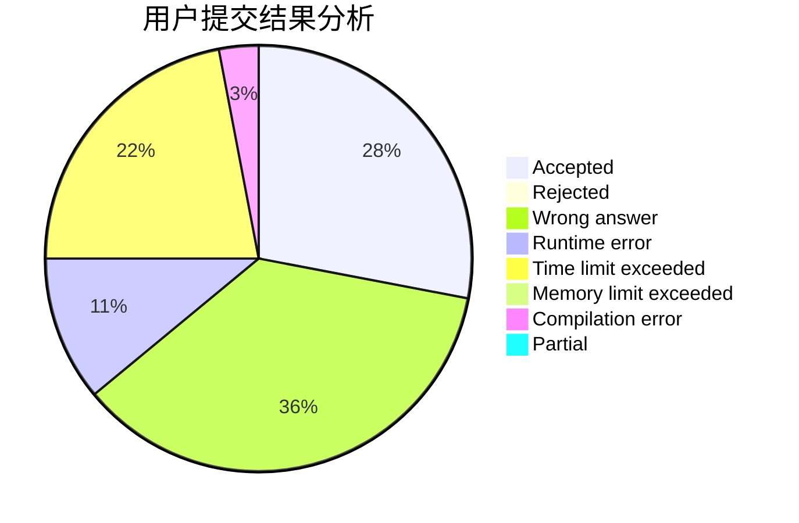
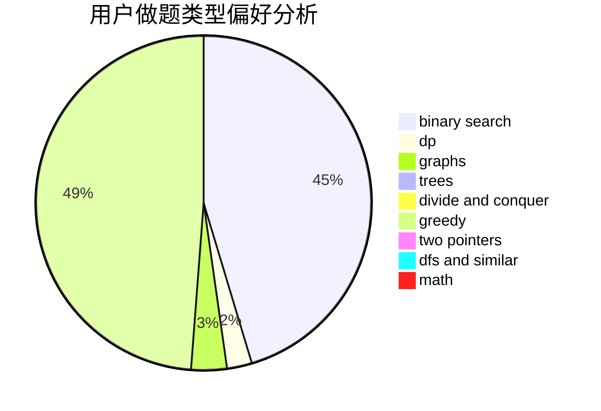

# yzx1798106406

<!-- tabs:start -->

#### **用户提交结果分析**

#### **用户做题类型偏好分析**

<!-- tabs:end -->
# 推荐题目
[453B](https://codeforces.com/contest/453/problem/B)
[1230F](https://codeforces.com/contest/1230/problem/F)
[418B](https://codeforces.com/contest/418/problem/B)
[898B](https://codeforces.com/contest/898/problem/B)
[611B](https://codeforces.com/contest/611/problem/B)
[514B](https://codeforces.com/contest/514/problem/B)
[1025E](https://codeforces.com/contest/1025/problem/E)
[10151](https://codeforces.com/contest/1015/problem/1)
[919E](https://codeforces.com/contest/919/problem/E)
[947C](https://codeforces.com/contest/947/problem/C)
