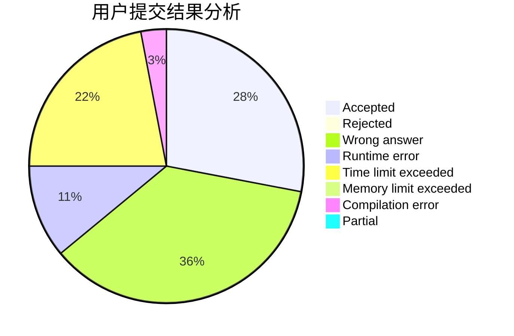
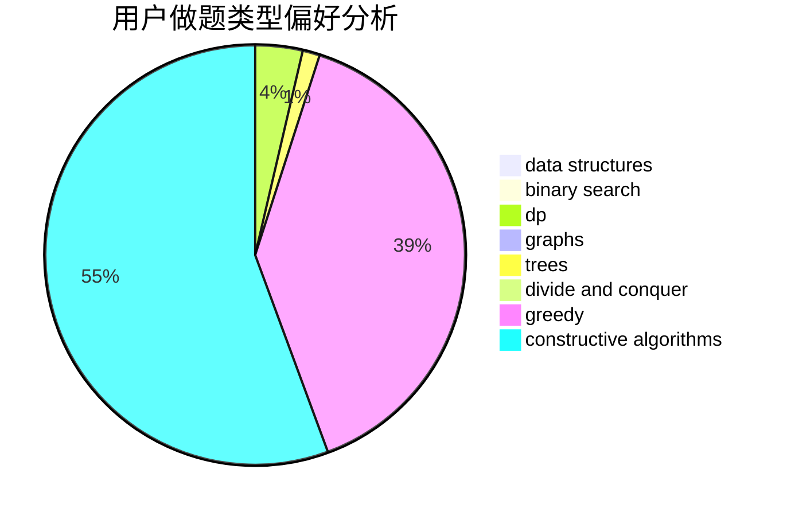
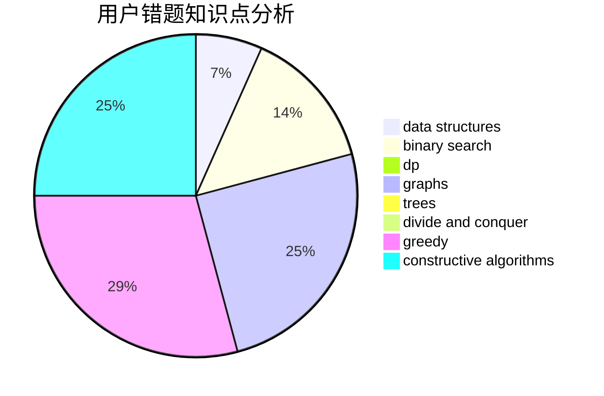

# yzx1798106406

<!-- tabs:start -->

#### **用户提交结果分析**

#### **用户做题类型偏好分析**

#### **用户错题知识点分析**

<!-- tabs:end -->
# 推荐题目
[431D](https://codeforces.com/contest/431/problem/D)		binary search,
                        bitmasks,
                        combinatorics,
                        dp,
                        math		  
[1223G](https://codeforces.com/contest/1223/problem/G)		binary search,
                        math,
                        number theory		  
[388E](https://codeforces.com/contest/388/problem/E)		geometry		  
[877C](https://codeforces.com/contest/877/problem/C)		constructive algorithms		  
[591D](https://codeforces.com/contest/591/problem/D)		dsu,graphs,sortings,trees		  
[494A](https://codeforces.com/contest/494/problem/A)		greedy		  
[1025B](https://codeforces.com/contest/1025/problem/B)		brute force,
                        greedy,
                        number theory		  
[1013C](https://codeforces.com/contest/1013/problem/C)		dsu,graphs,sortings,trees		  
[903E](https://codeforces.com/contest/903/problem/E)		brute force,
                        hashing,
                        implementation,
                        strings		  
[923E](https://codeforces.com/contest/923/problem/E)		fft,
                        math,
                        matrices		  
