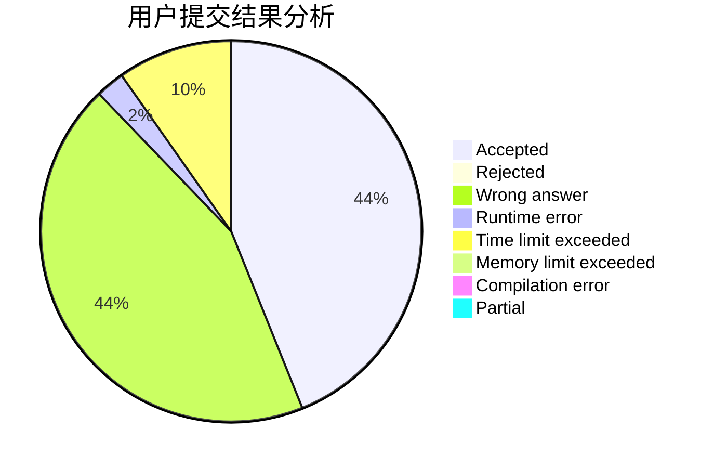
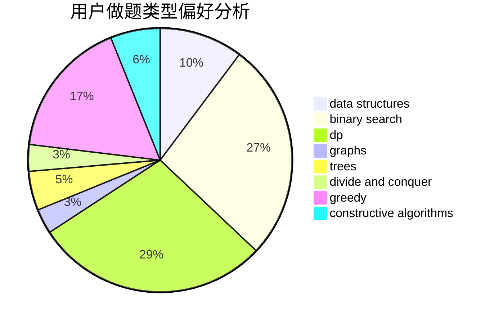
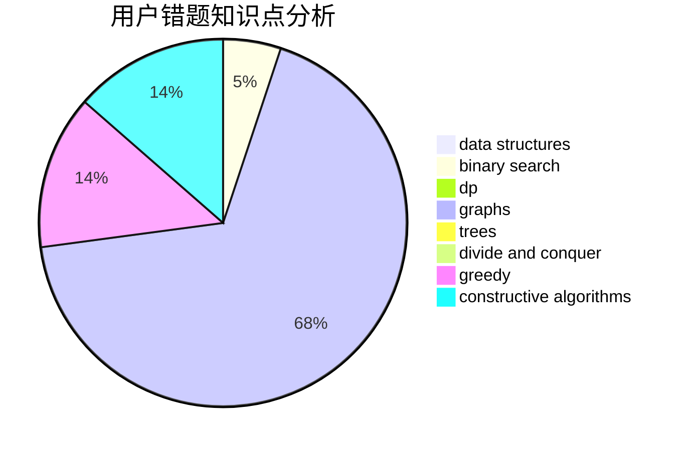

# yzxx

<!-- tabs:start -->

#### **用户提交结果分析**

#### **用户做题类型偏好分析**

#### **用户错题知识点分析**

<!-- tabs:end -->
# 推荐题目
[1499E](https://codeforces.com/contest/1499/problem/E)		combinatorics,
                        dp,
                        math,
                        strings		  
[1428F](https://codeforces.com/contest/1428/problem/F)		binary search,
                        data structures,
                        divide and conquer,
                        dp,
                        two pointers		  
[1195F](https://codeforces.com/contest/1195/problem/F)		data structures,
                        geometry,
                        math,
                        sortings		  
[1358D](https://codeforces.com/contest/1358/problem/D)		binary search,
                        brute force,
                        greedy,
                        implementation,
                        two pointers		  
[982E](https://codeforces.com/contest/982/problem/E)		geometry,
                        number theory		  
[585B](https://codeforces.com/contest/585/problem/B)		dfs and similar,
                        graphs,
                        shortest paths		  
[1481F](https://codeforces.com/contest/1481/problem/F)		dp,
                        greedy,
                        trees		  
[1179B](https://codeforces.com/contest/1179/problem/B)		constructive algorithms		  
[780H](https://codeforces.com/contest/780/problem/H)		binary search,
                        geometry,
                        implementation,
                        two pointers		  
[711C](https://codeforces.com/contest/711/problem/C)		dp		  
