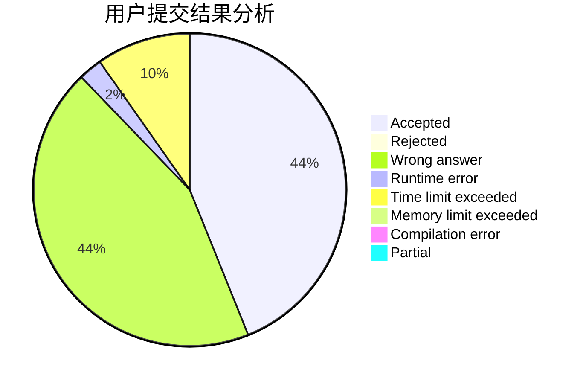
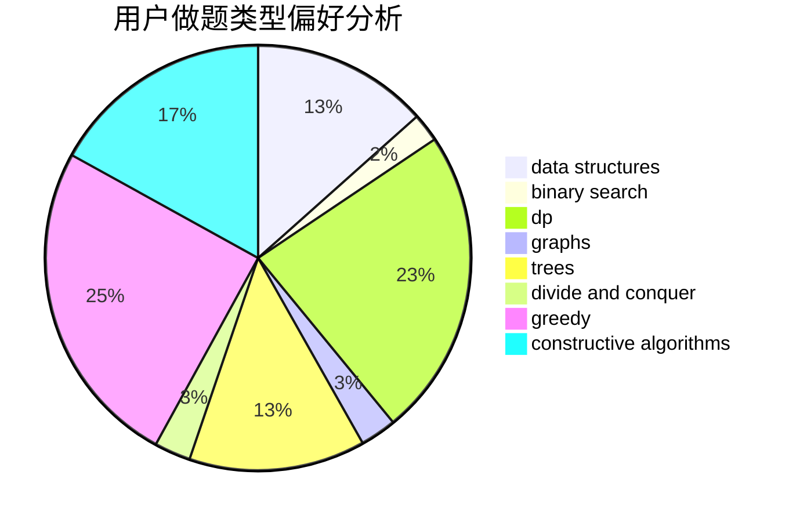
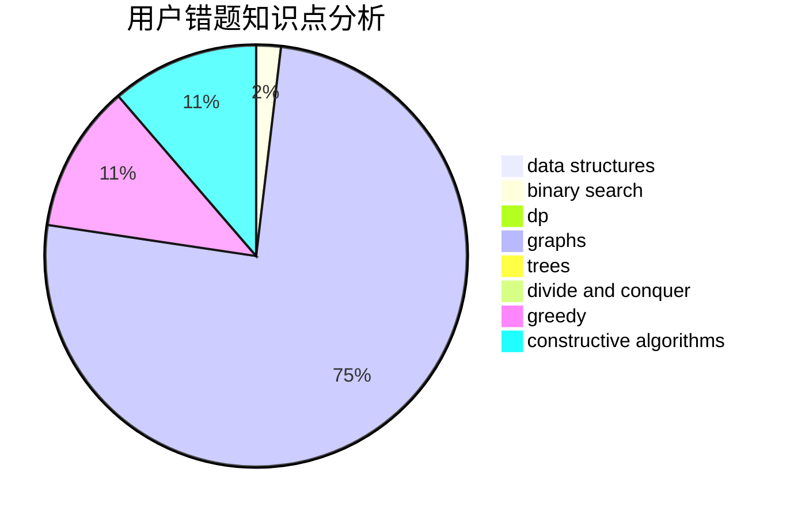

# yzxx

<!-- tabs:start -->

#### **用户提交结果分析**

#### **用户做题类型偏好分析**

#### **用户错题知识点分析**

<!-- tabs:end -->
# 推荐题目
[1509E](https://codeforces.com/contest/1509/problem/E)		dsu,graphs,sortings,trees		  
[1437F](https://codeforces.com/contest/1437/problem/F)		combinatorics,
                        dp,
                        math,
                        two pointers		  
[11A](https://codeforces.com/contest/11/problem/A)		constructive algorithms,
                        implementation,
                        math		  
[1366F](https://codeforces.com/contest/1366/problem/F)		binary search,
                        dp,
                        geometry,
                        graphs		  
[998C](https://codeforces.com/contest/998/problem/C)		dsu,graphs,sortings,trees		  
[605C](https://codeforces.com/contest/605/problem/C)		geometry		  
[148A](https://codeforces.com/contest/148/problem/A)		constructive algorithms,
                        implementation,
                        math		  
[1182A](https://codeforces.com/contest/1182/problem/A)		dp,
                        math		  
[79D](https://codeforces.com/contest/79/problem/D)		bitmasks,
                        dp,
                        shortest paths		  
[731C](https://codeforces.com/contest/731/problem/C)		dfs and similar,
                        dsu,
                        graphs,
                        greedy		  
