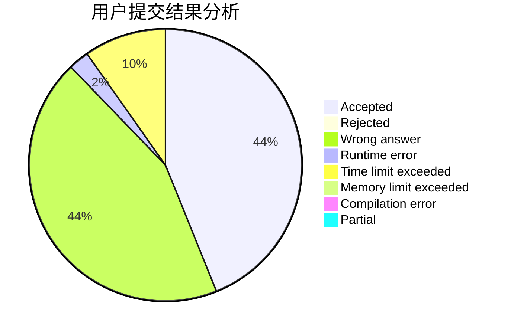
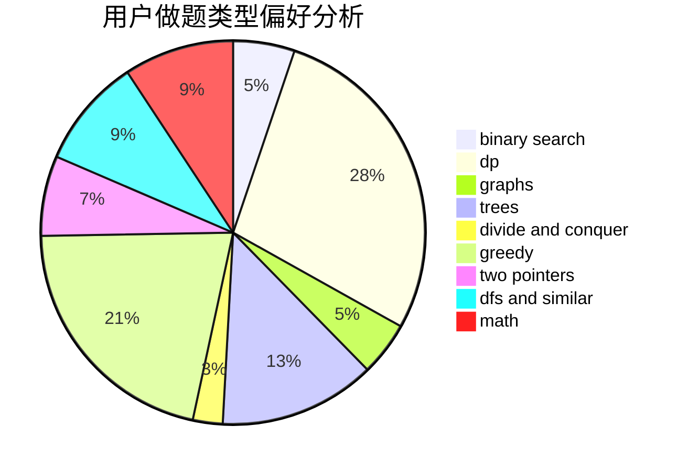

# yzxx

<!-- tabs:start -->

#### **用户提交结果分析**

#### **用户做题类型偏好分析**

<!-- tabs:end -->
# 推荐题目
[1509E](https://codeforces.com/contest/1509/problem/E)
[1437F](https://codeforces.com/contest/1437/problem/F)
[11A](https://codeforces.com/contest/11/problem/A)
[1366F](https://codeforces.com/contest/1366/problem/F)
[998C](https://codeforces.com/contest/998/problem/C)
[605C](https://codeforces.com/contest/605/problem/C)
[148A](https://codeforces.com/contest/148/problem/A)
[1182A](https://codeforces.com/contest/1182/problem/A)
[79D](https://codeforces.com/contest/79/problem/D)
[731C](https://codeforces.com/contest/731/problem/C)
