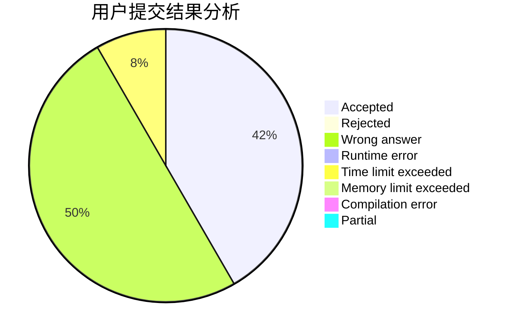
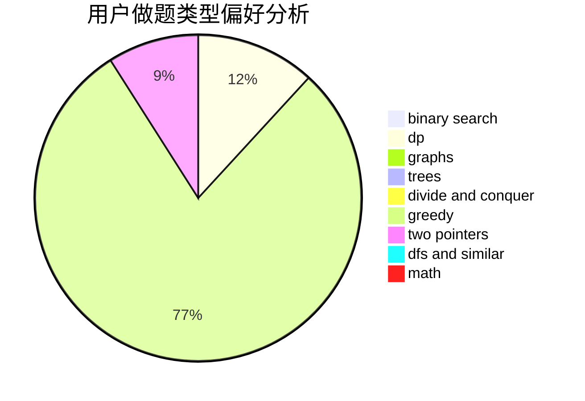

# yzy1

<!-- tabs:start -->

#### **用户提交结果分析**

#### **用户做题类型偏好分析**

<!-- tabs:end -->
# 推荐题目
[1484A](https://codeforces.com/contest/1484/problem/A)
[1265D](https://codeforces.com/contest/1265/problem/D)
[581B](https://codeforces.com/contest/581/problem/B)
[482A](https://codeforces.com/contest/482/problem/A)
[623A](https://codeforces.com/contest/623/problem/A)
[1267E](https://codeforces.com/contest/1267/problem/E)
[1196C](https://codeforces.com/contest/1196/problem/C)
[467C](https://codeforces.com/contest/467/problem/C)
[1350B](https://codeforces.com/contest/1350/problem/B)
[13D](https://codeforces.com/contest/13/problem/D)
