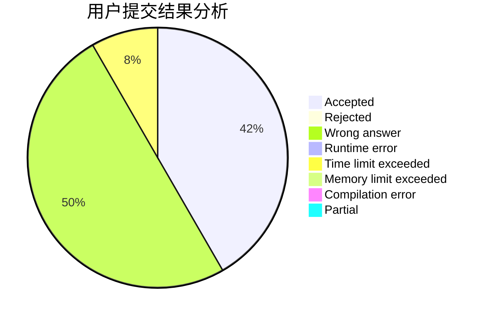
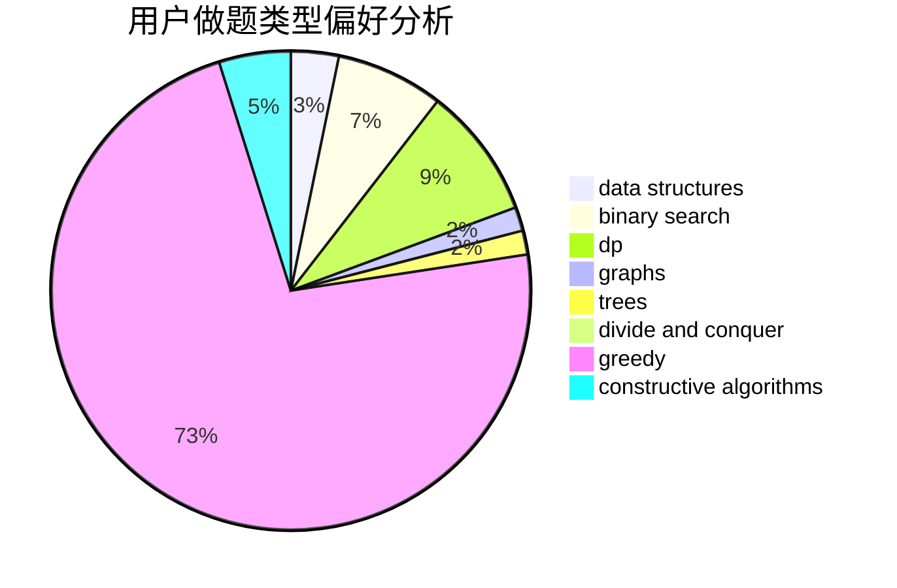
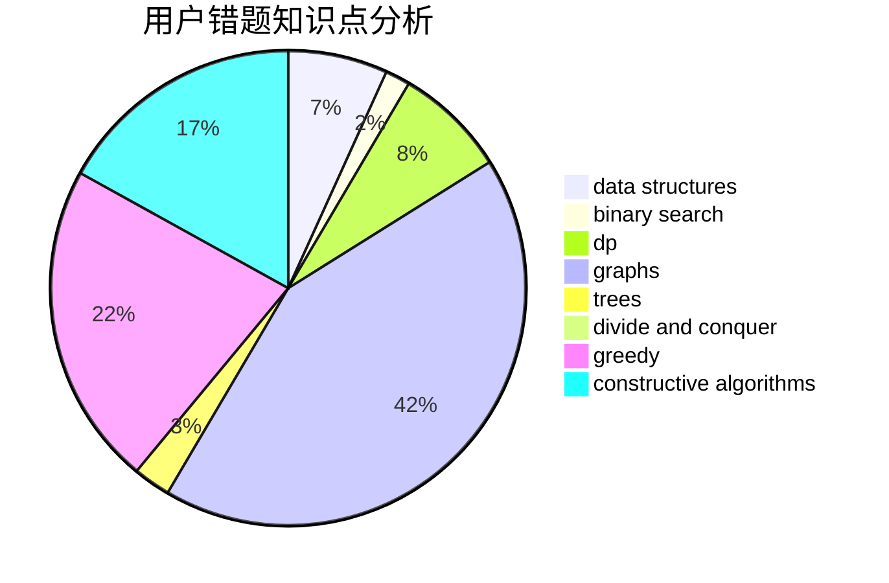

# yzy1

<!-- tabs:start -->

#### **用户提交结果分析**

#### **用户做题类型偏好分析**

#### **用户错题知识点分析**

<!-- tabs:end -->
# 推荐题目
[1475D](https://codeforces.com/contest/1475/problem/D)		binary search,
                        dp,
                        sortings,
                        two pointers		  
[125D](https://codeforces.com/contest/125/problem/D)		constructive algorithms,
                        greedy		  
[558D](https://codeforces.com/contest/558/problem/D)		data structures,
                        implementation,
                        sortings		  
[462A](https://codeforces.com/contest/462/problem/A)		brute force,
                        implementation		  
[605A](https://codeforces.com/contest/605/problem/A)		constructive algorithms,
                        greedy		  
[1261D2](https://codeforces.com/contest/1261D/problem/2)		dsu,graphs,sortings,trees		  
[1190E](https://codeforces.com/contest/1190/problem/E)		binary search,
                        greedy		  
[447A](https://codeforces.com/contest/447/problem/A)		implementation		  
[1343D](https://codeforces.com/contest/1343/problem/D)		brute force,
                        data structures,
                        greedy,
                        two pointers		  
[1392B](https://codeforces.com/contest/1392/problem/B)		implementation,
                        math		  
