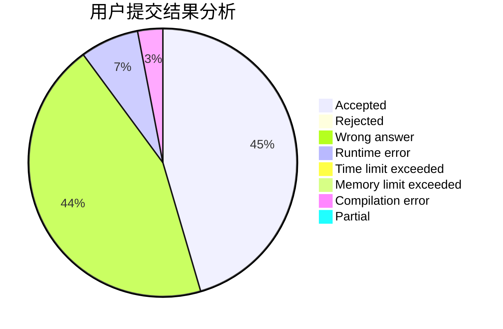
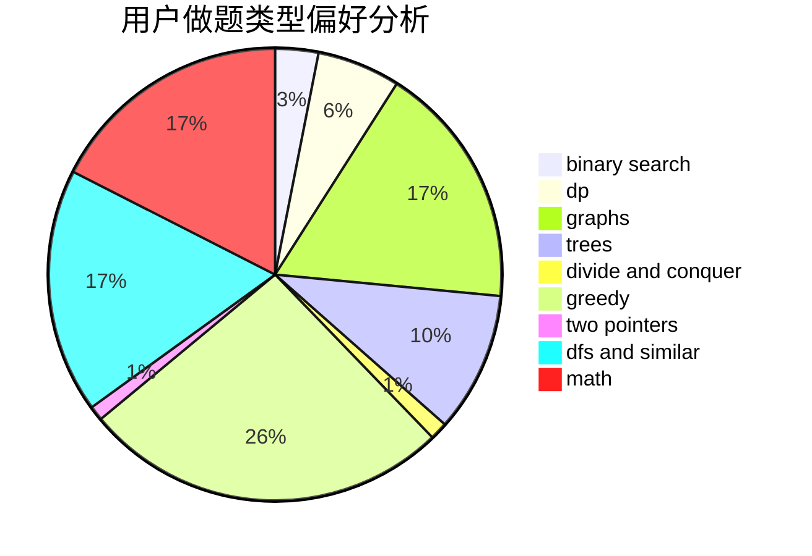

# z26y25

<!-- tabs:start -->

#### **用户提交结果分析**

#### **用户做题类型偏好分析**

<!-- tabs:end -->
# 推荐题目
[747A](https://codeforces.com/contest/747/problem/A)
[1351C](https://codeforces.com/contest/1351/problem/C)
[1129D](https://codeforces.com/contest/1129/problem/D)
[566D](https://codeforces.com/contest/566/problem/D)
[507E](https://codeforces.com/contest/507/problem/E)
[896A](https://codeforces.com/contest/896/problem/A)
[1446E](https://codeforces.com/contest/1446/problem/E)
[631B](https://codeforces.com/contest/631/problem/B)
[883C](https://codeforces.com/contest/883/problem/C)
[343A](https://codeforces.com/contest/343/problem/A)
