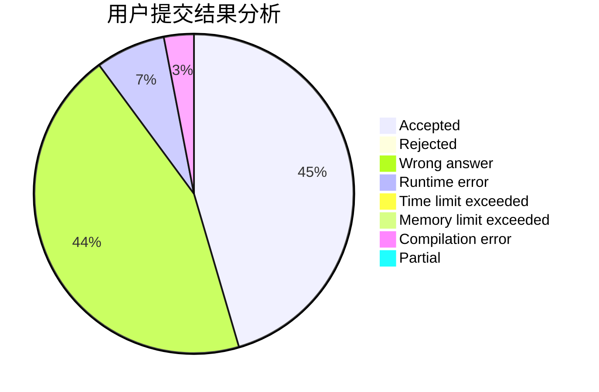
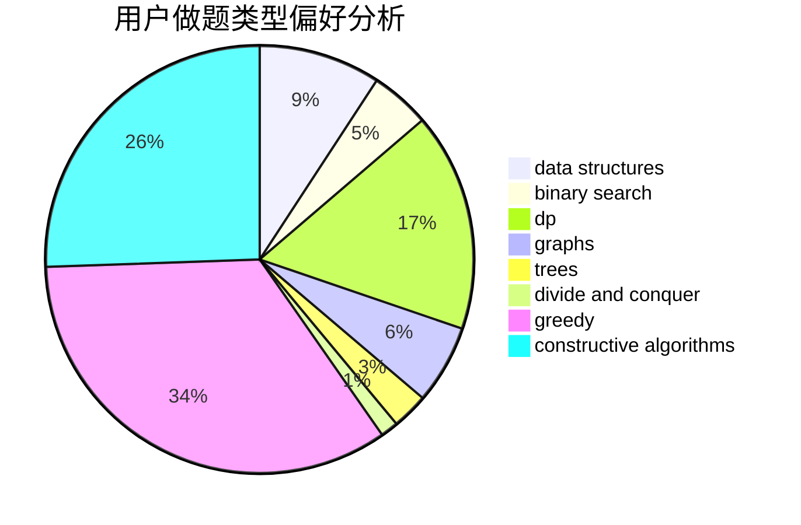
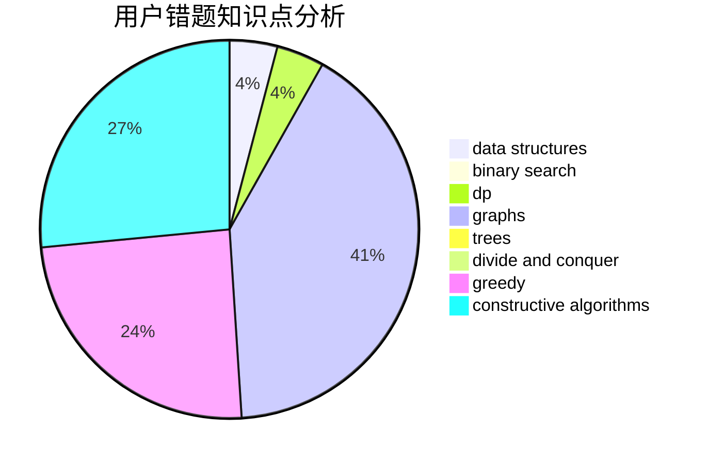

# z26y25

<!-- tabs:start -->

#### **用户提交结果分析**

#### **用户做题类型偏好分析**

#### **用户错题知识点分析**

<!-- tabs:end -->
# 推荐题目
[730B](https://codeforces.com/contest/730/problem/B)		constructive algorithms,
                        interactive		  
[1344D](https://codeforces.com/contest/1344/problem/D)		binary search,
                        greedy,
                        math		  
[1119H](https://codeforces.com/contest/1119/problem/H)		fft,
                        math		  
[540C](https://codeforces.com/contest/540/problem/C)		dfs and similar		  
[486E](https://codeforces.com/contest/486/problem/E)		data structures,
                        dp,
                        greedy,
                        hashing,
                        math		  
[875F](https://codeforces.com/contest/875/problem/F)		dsu,
                        graphs,
                        greedy		  
[1436F](https://codeforces.com/contest/1436/problem/F)		combinatorics,
                        math,
                        number theory		  
[612A](https://codeforces.com/contest/612/problem/A)		brute force,
                        implementation,
                        strings		  
[863A](https://codeforces.com/contest/863/problem/A)		brute force,
                        implementation		  
[316E2](https://codeforces.com/contest/316E/problem/2)		data structures,
                        math		  
