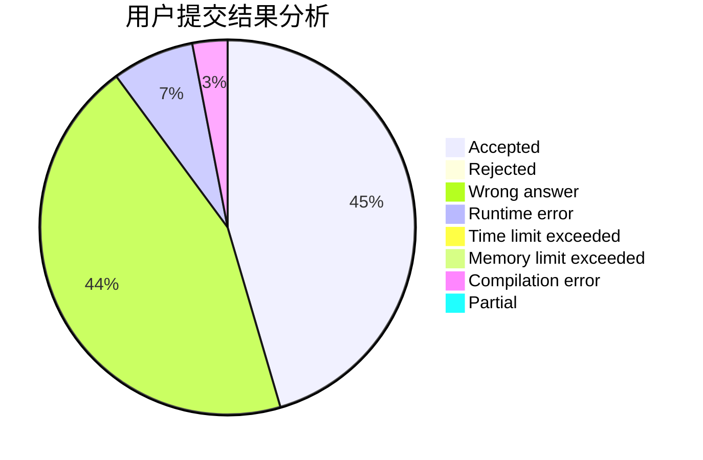
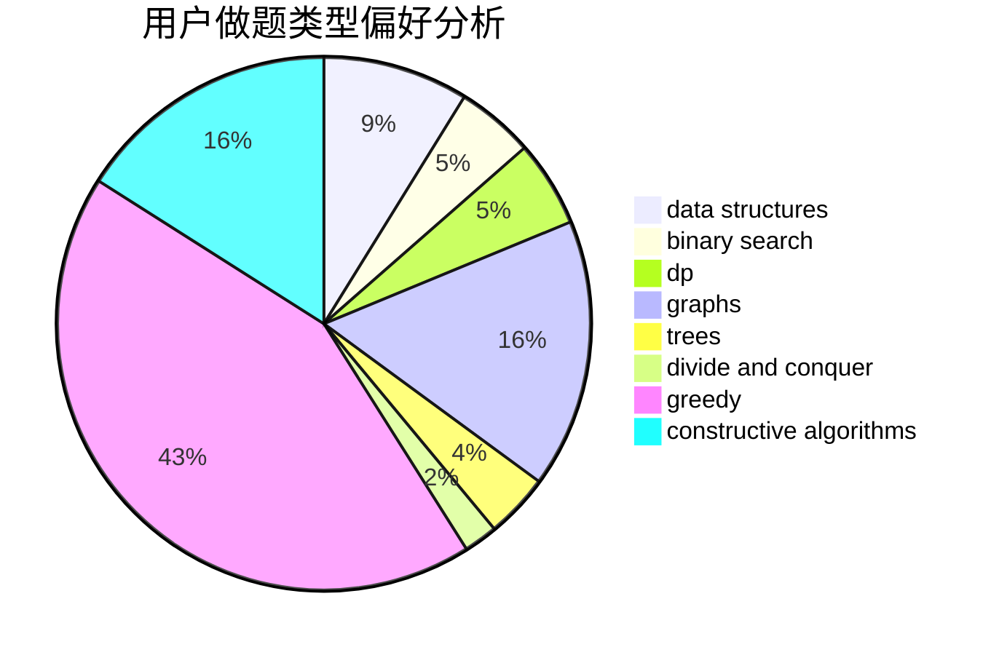
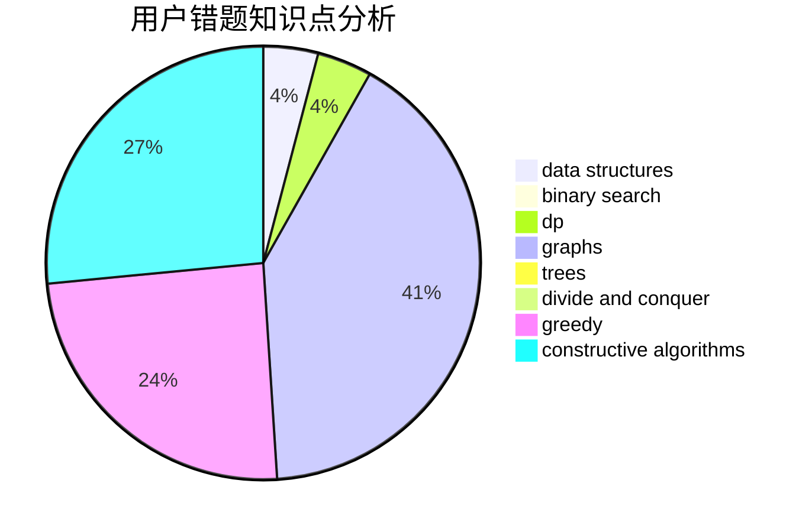

# z26y25

<!-- tabs:start -->

#### **用户提交结果分析**

#### **用户做题类型偏好分析**

#### **用户错题知识点分析**

<!-- tabs:end -->
# 推荐题目
[747A](https://codeforces.com/contest/747/problem/A)		brute force,
                        math		  
[1351C](https://codeforces.com/contest/1351/problem/C)		data structures,
                        implementation		  
[1129D](https://codeforces.com/contest/1129/problem/D)		data structures,
                        dp		  
[566D](https://codeforces.com/contest/566/problem/D)		data structures,
                        dsu		  
[507E](https://codeforces.com/contest/507/problem/E)		dfs and similar,
                        dp,
                        graphs,
                        shortest paths		  
[896A](https://codeforces.com/contest/896/problem/A)		binary search,
                        dfs and similar		  
[1446E](https://codeforces.com/contest/1446/problem/E)		constructive algorithms,
                        dfs and similar		  
[631B](https://codeforces.com/contest/631/problem/B)		constructive algorithms,
                        implementation		  
[883C](https://codeforces.com/contest/883/problem/C)		binary search,
                        implementation		  
[343A](https://codeforces.com/contest/343/problem/A)		math,
                        number theory		  
