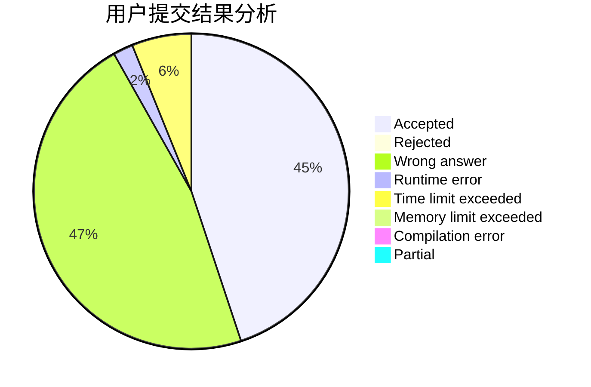
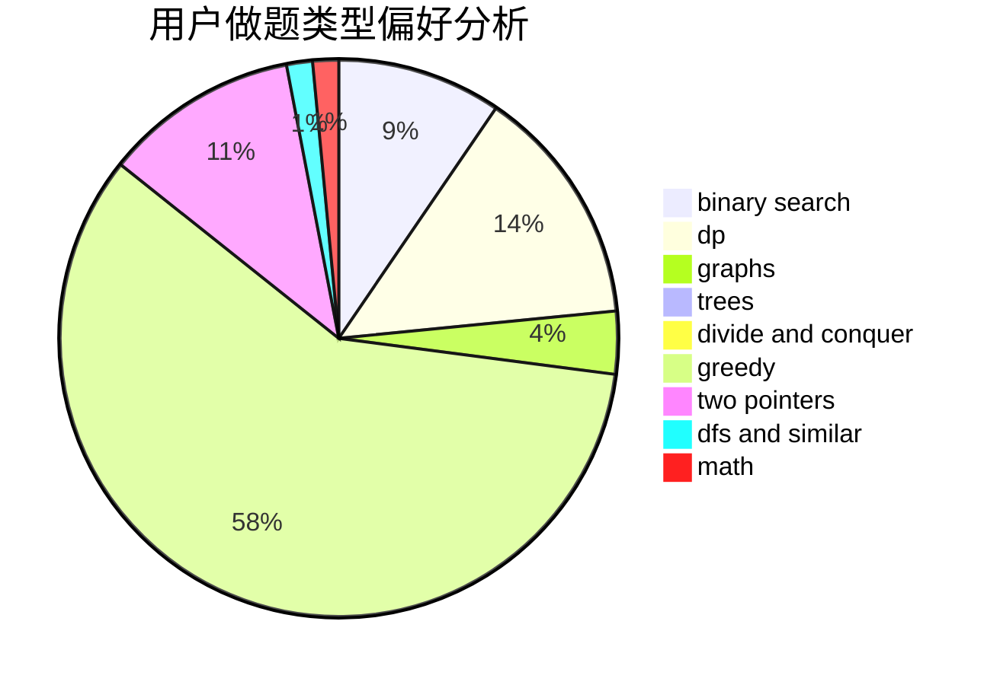

# z_x

<!-- tabs:start -->

#### **用户提交结果分析**

#### **用户做题类型偏好分析**

<!-- tabs:end -->
# 推荐题目
[1422A](https://codeforces.com/contest/1422/problem/A)
[1408D](https://codeforces.com/contest/1408/problem/D)
[1140D](https://codeforces.com/contest/1140/problem/D)
[1367C](https://codeforces.com/contest/1367/problem/C)
[985E](https://codeforces.com/contest/985/problem/E)
[962B](https://codeforces.com/contest/962/problem/B)
[38C](https://codeforces.com/contest/38/problem/C)
[571C](https://codeforces.com/contest/571/problem/C)
[1078E](https://codeforces.com/contest/1078/problem/E)
[15C](https://codeforces.com/contest/15/problem/C)
