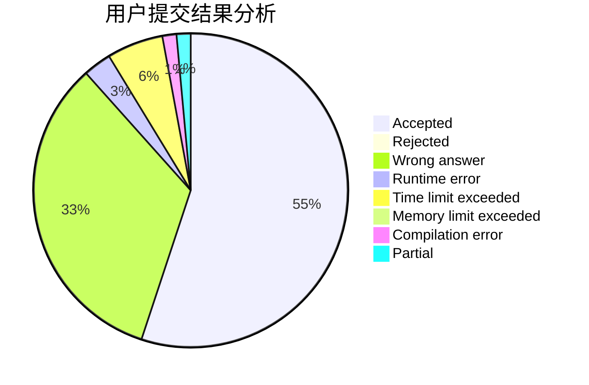
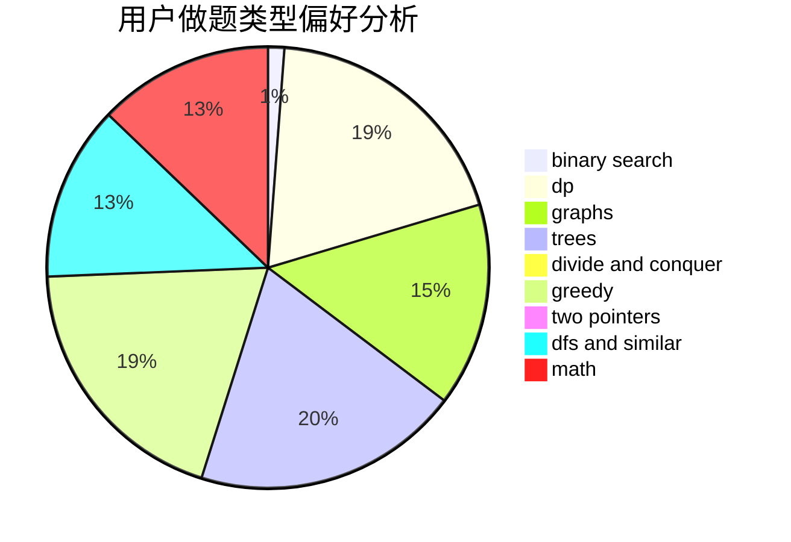

# zaq1xsw2tktk

<!-- tabs:start -->

#### **用户提交结果分析**

#### **用户做题类型偏好分析**

<!-- tabs:end -->
# 推荐题目
[44E](https://codeforces.com/contest/44/problem/E)
[617B](https://codeforces.com/contest/617/problem/B)
[436E](https://codeforces.com/contest/436/problem/E)
[962F](https://codeforces.com/contest/962/problem/F)
[124A](https://codeforces.com/contest/124/problem/A)
[903B](https://codeforces.com/contest/903/problem/B)
[753C](https://codeforces.com/contest/753/problem/C)
[1237G](https://codeforces.com/contest/1237/problem/G)
[11781](https://codeforces.com/contest/1178/problem/1)
[759D](https://codeforces.com/contest/759/problem/D)
