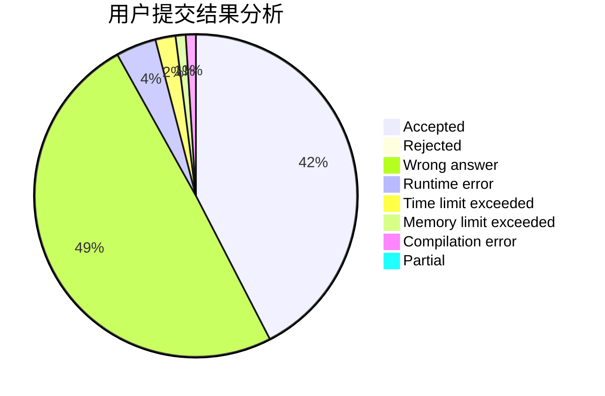
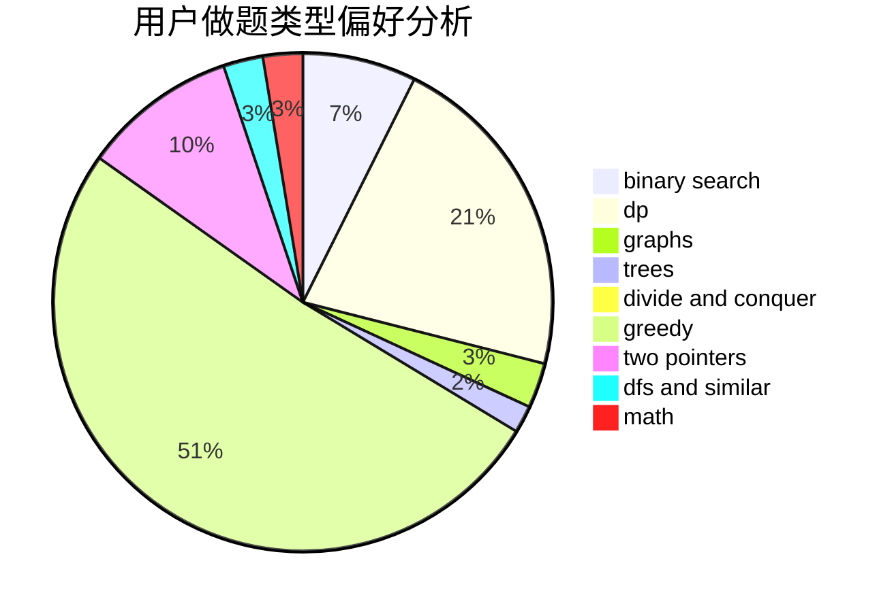

# zarathu

<!-- tabs:start -->

#### **用户提交结果分析**

#### **用户做题类型偏好分析**

<!-- tabs:end -->
# 推荐题目
[1349E](https://codeforces.com/contest/1349/problem/E)
[1465F](https://codeforces.com/contest/1465/problem/F)
[1091H](https://codeforces.com/contest/1091/problem/H)
[808F](https://codeforces.com/contest/808/problem/F)
[1194E](https://codeforces.com/contest/1194/problem/E)
[678B](https://codeforces.com/contest/678/problem/B)
[12622](https://codeforces.com/contest/1262/problem/2)
[515E](https://codeforces.com/contest/515/problem/E)
[830E](https://codeforces.com/contest/830/problem/E)
[1217B](https://codeforces.com/contest/1217/problem/B)
