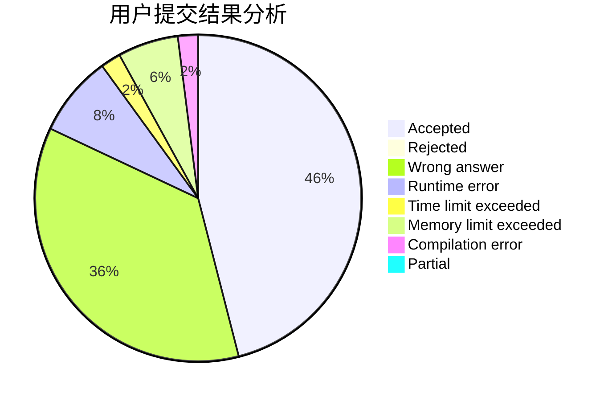
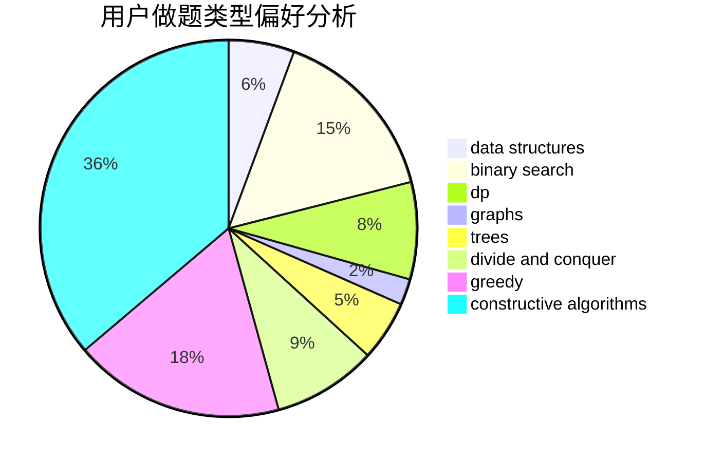
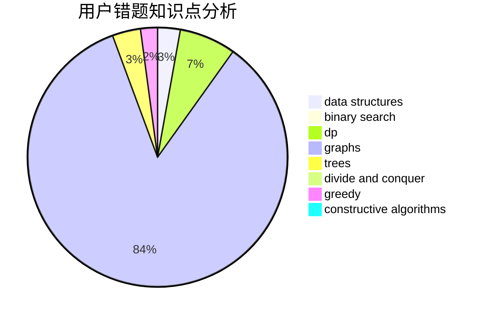

# ChenKaifeng

<!-- tabs:start -->

#### **用户提交结果分析**

#### **用户做题类型偏好分析**

#### **用户错题知识点分析**

<!-- tabs:end -->
# 推荐题目
[1272B](https://codeforces.com/contest/1272/problem/B)		constructive algorithms,
                        greedy,
                        implementation		  
[1368G](https://codeforces.com/contest/1368/problem/G)		data structures,
                        geometry,
                        graphs,
                        trees		  
[453A](https://codeforces.com/contest/453/problem/A)		probabilities		  
[696A](https://codeforces.com/contest/696/problem/A)		brute force,
                        data structures,
                        implementation,
                        trees		  
[1367A](https://codeforces.com/contest/1367/problem/A)		implementation,
                        strings		  
[1103C](https://codeforces.com/contest/1103/problem/C)		constructive algorithms,
                        dfs and similar,
                        graphs,
                        math		  
[1368C](https://codeforces.com/contest/1368/problem/C)		constructive algorithms		  
[455A](https://codeforces.com/contest/455/problem/A)		dp		  
[1003B](https://codeforces.com/contest/1003/problem/B)		constructive algorithms		  
[1344E](https://codeforces.com/contest/1344/problem/E)		data structures,
                        trees		  
