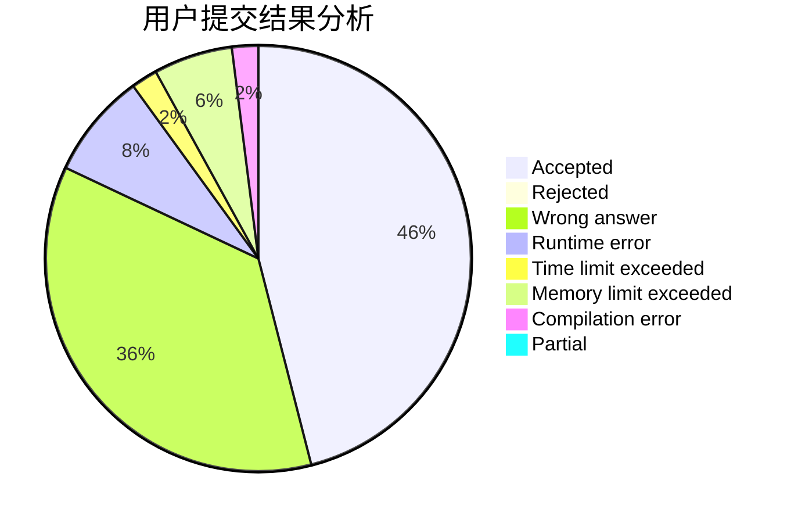
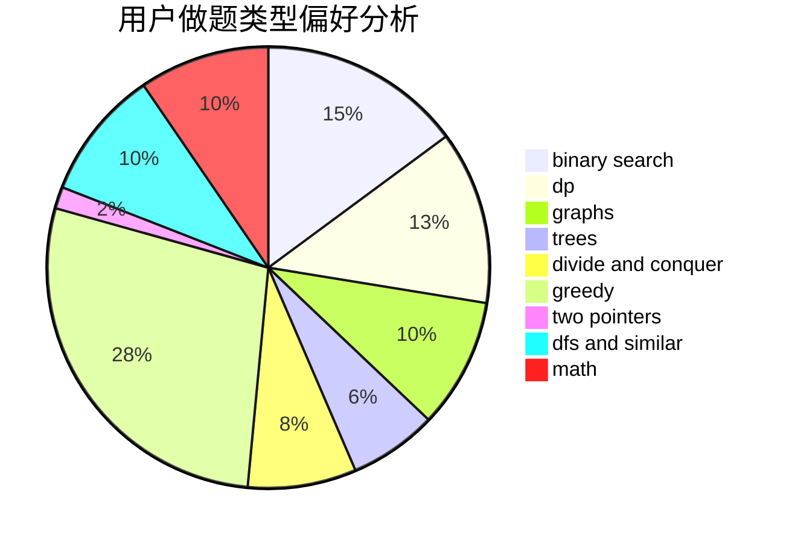

# ChenKaifeng

<!-- tabs:start -->

#### **用户提交结果分析**

#### **用户做题类型偏好分析**

<!-- tabs:end -->
# 推荐题目
[1272B](https://codeforces.com/contest/1272/problem/B)
[1368G](https://codeforces.com/contest/1368/problem/G)
[453A](https://codeforces.com/contest/453/problem/A)
[696A](https://codeforces.com/contest/696/problem/A)
[1367A](https://codeforces.com/contest/1367/problem/A)
[1103C](https://codeforces.com/contest/1103/problem/C)
[1368C](https://codeforces.com/contest/1368/problem/C)
[455A](https://codeforces.com/contest/455/problem/A)
[1003B](https://codeforces.com/contest/1003/problem/B)
[1344E](https://codeforces.com/contest/1344/problem/E)
