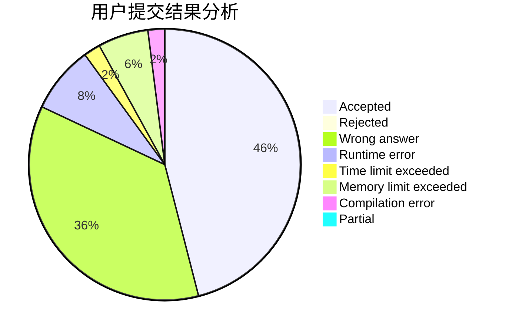
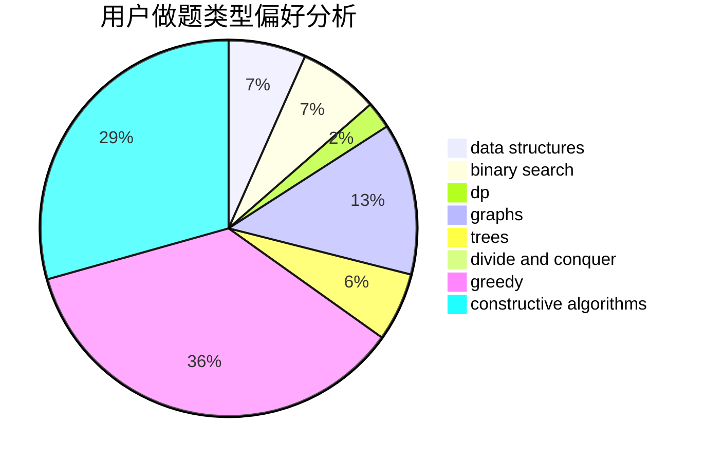
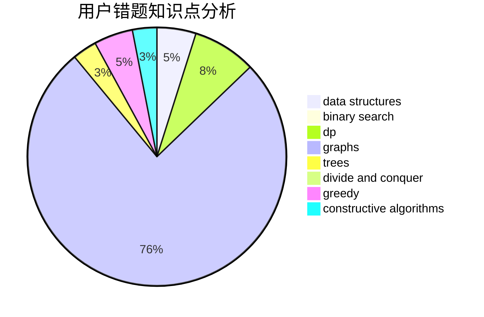

# ChenKaifeng

<!-- tabs:start -->

#### **用户提交结果分析**

#### **用户做题类型偏好分析**

#### **用户错题知识点分析**

<!-- tabs:end -->
# 推荐题目
[1266G](https://codeforces.com/contest/1266/problem/G)		string suffix structures		  
[1360H](https://codeforces.com/contest/1360/problem/H)		binary search,
                        bitmasks,
                        brute force,
                        constructive algorithms		  
[431C](https://codeforces.com/contest/431/problem/C)		dp,
                        implementation,
                        trees		  
[670C](https://codeforces.com/contest/670/problem/C)		implementation,
                        sortings		  
[1359B](https://codeforces.com/contest/1359/problem/B)		brute force,
                        dp,
                        greedy,
                        implementation,
                        two pointers		  
[1102F](https://codeforces.com/contest/1102/problem/F)		binary search,
                        bitmasks,
                        brute force,
                        dp,
                        graphs		  
[1360D](https://codeforces.com/contest/1360/problem/D)		math,
                        number theory		  
[434B](https://codeforces.com/contest/434/problem/B)		dsu,graphs,sortings,trees		  
[1002E1](https://codeforces.com/contest/1002E/problem/1)		nan		  
[1337C](https://codeforces.com/contest/1337/problem/C)		dsu,graphs,sortings,trees		  
