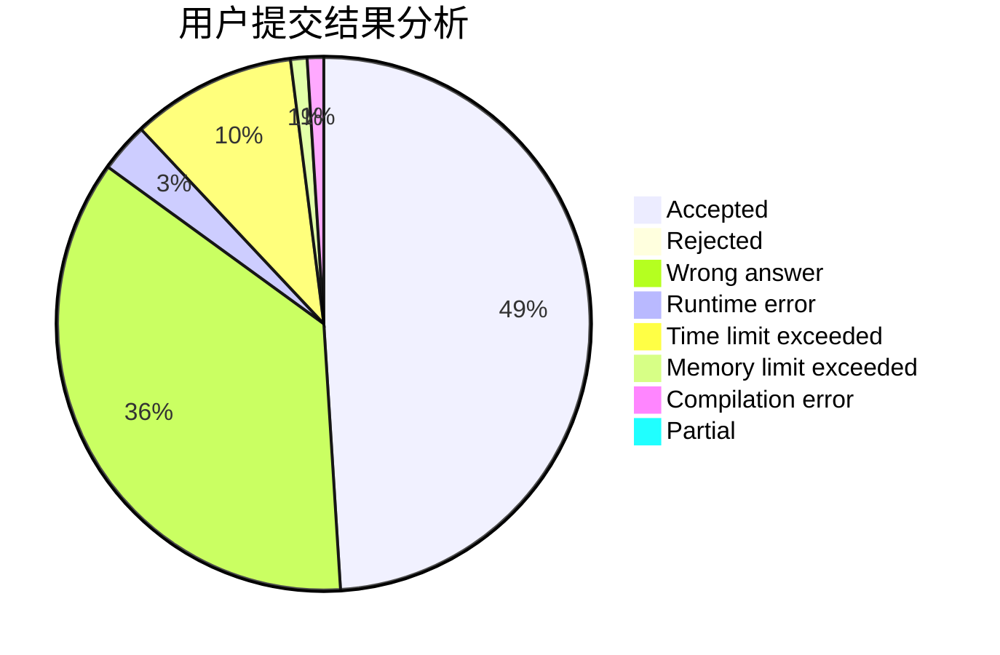
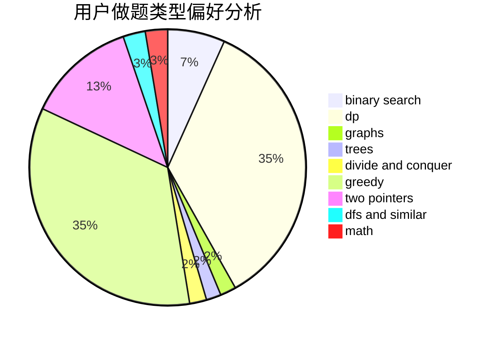

# zbsnb

<!-- tabs:start -->

#### **用户提交结果分析**

#### **用户做题类型偏好分析**

<!-- tabs:end -->
# 推荐题目
[1451B](https://codeforces.com/contest/1451/problem/B)
[1111C](https://codeforces.com/contest/1111/problem/C)
[183A](https://codeforces.com/contest/183/problem/A)
[1080D](https://codeforces.com/contest/1080/problem/D)
[489F](https://codeforces.com/contest/489/problem/F)
[364E](https://codeforces.com/contest/364/problem/E)
[1044F](https://codeforces.com/contest/1044/problem/F)
[1346B](https://codeforces.com/contest/1346/problem/B)
[675E](https://codeforces.com/contest/675/problem/E)
[190E](https://codeforces.com/contest/190/problem/E)
