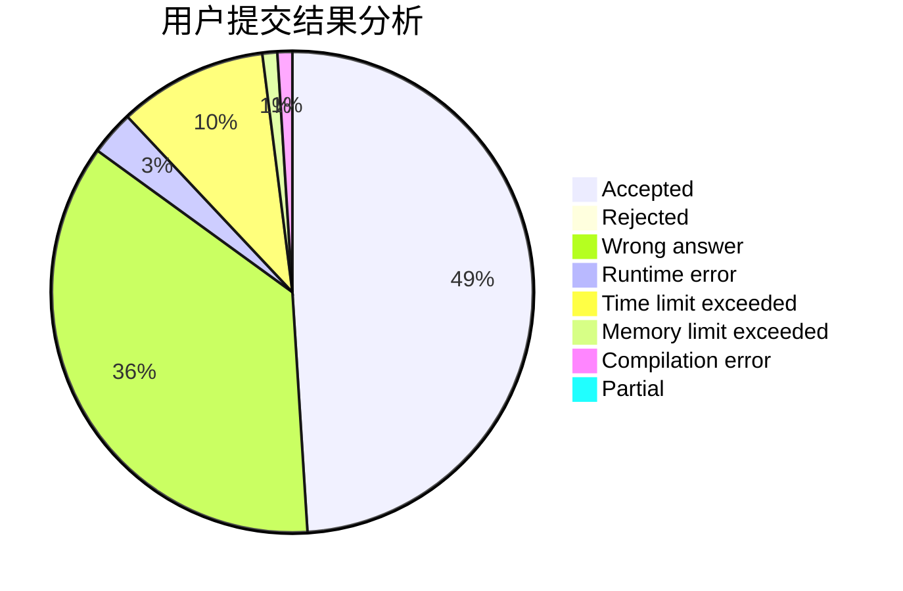
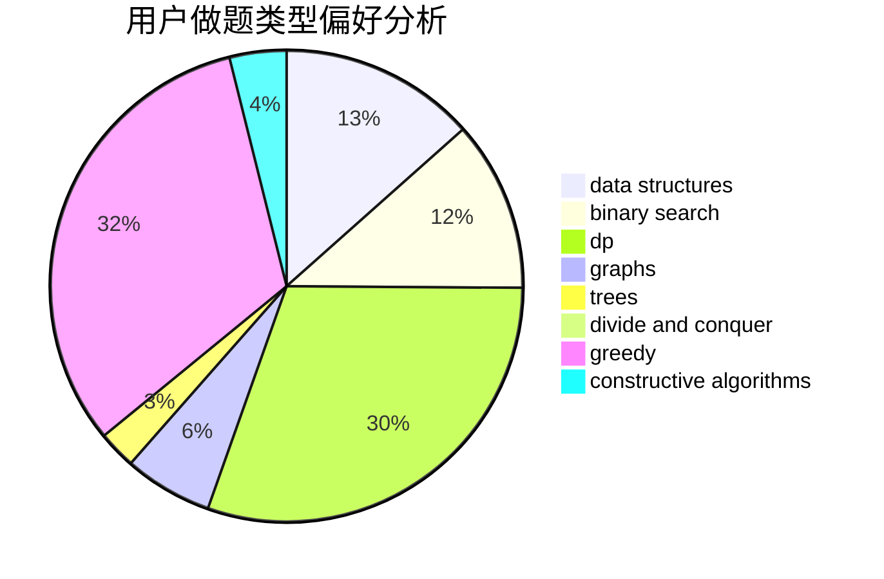
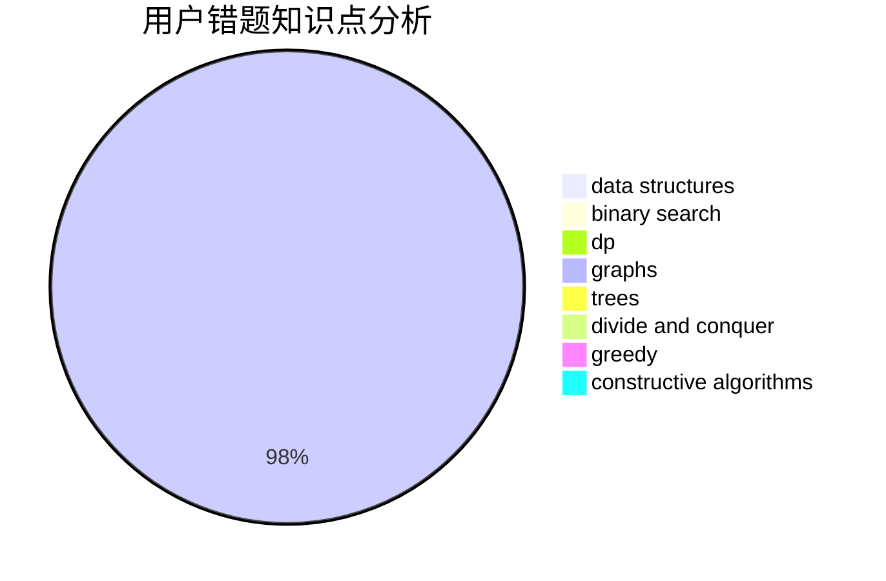

# zbsnb

<!-- tabs:start -->

#### **用户提交结果分析**

#### **用户做题类型偏好分析**

#### **用户错题知识点分析**

<!-- tabs:end -->
# 推荐题目
[1451B](https://codeforces.com/contest/1451/problem/B)		dp,
                        greedy,
                        implementation,
                        strings		  
[1111C](https://codeforces.com/contest/1111/problem/C)		binary search,
                        brute force,
                        divide and conquer,
                        math		  
[183A](https://codeforces.com/contest/183/problem/A)		constructive algorithms,
                        math		  
[1080D](https://codeforces.com/contest/1080/problem/D)		constructive algorithms,
                        implementation,
                        math		  
[489F](https://codeforces.com/contest/489/problem/F)		combinatorics,
                        dp		  
[364E](https://codeforces.com/contest/364/problem/E)		divide and conquer,
                        two pointers		  
[1044F](https://codeforces.com/contest/1044/problem/F)		data structures		  
[1346B](https://codeforces.com/contest/1346/problem/B)		*special problem,
                        greedy		  
[675E](https://codeforces.com/contest/675/problem/E)		data structures,
                        dp,
                        greedy		  
[190E](https://codeforces.com/contest/190/problem/E)		data structures,
                        dsu,
                        graphs,
                        hashing,
                        sortings		  
