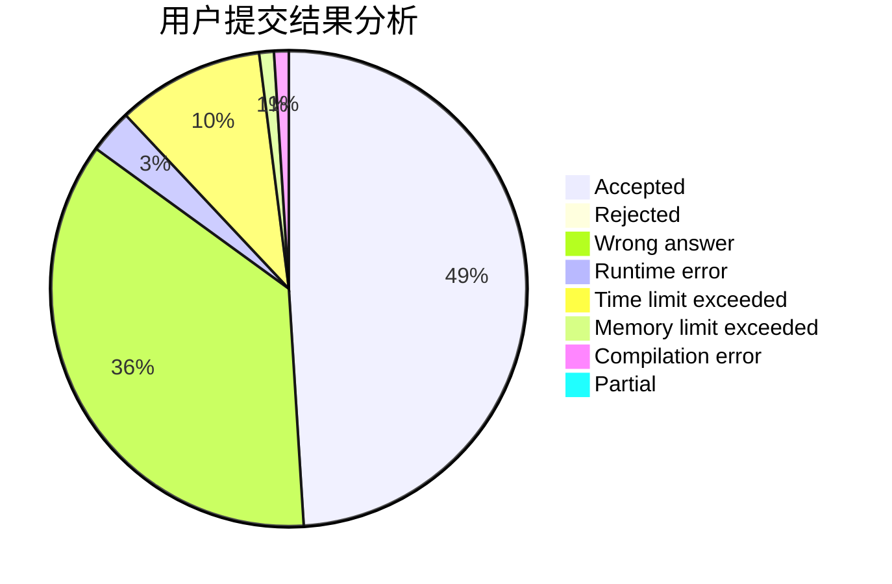
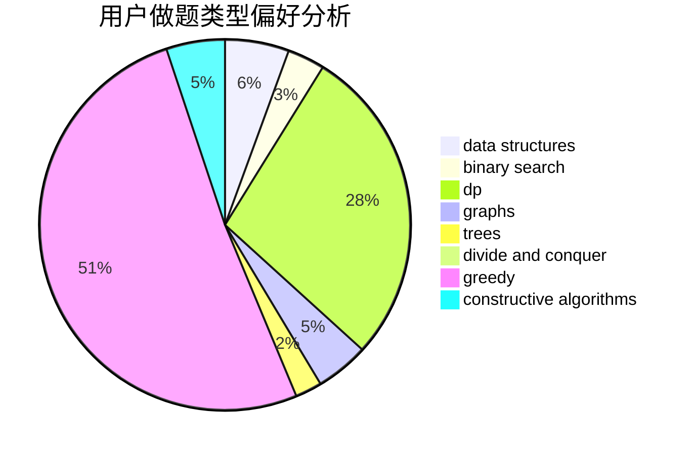
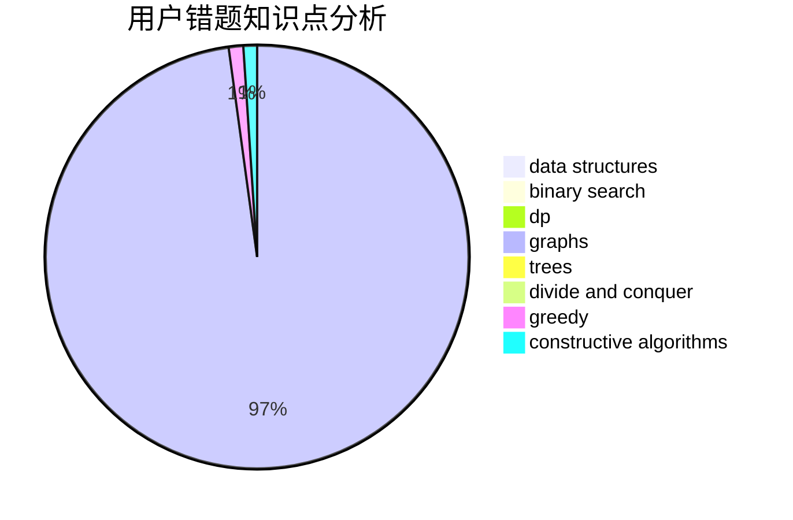

# zbsnb

<!-- tabs:start -->

#### **用户提交结果分析**

#### **用户做题类型偏好分析**

#### **用户错题知识点分析**

<!-- tabs:end -->
# 推荐题目
[1440C2](https://codeforces.com/contest/1440C/problem/2)		dsu,graphs,sortings,trees		  
[1110H](https://codeforces.com/contest/1110/problem/H)		dp,
                        strings		  
[15D](https://codeforces.com/contest/15/problem/D)		data structures,
                        implementation,
                        sortings		  
[1080A](https://codeforces.com/contest/1080/problem/A)		math		  
[471A](https://codeforces.com/contest/471/problem/A)		implementation		  
[339A](https://codeforces.com/contest/339/problem/A)		greedy,
                        implementation,
                        sortings,
                        strings		  
[1044A](https://codeforces.com/contest/1044/problem/A)		binary search,
                        two pointers		  
[1339B](https://codeforces.com/contest/1339/problem/B)		constructive algorithms,
                        sortings		  
[652A](https://codeforces.com/contest/652/problem/A)		implementation,
                        math		  
[165E](https://codeforces.com/contest/165/problem/E)		bitmasks,
                        brute force,
                        dfs and similar,
                        dp		  
