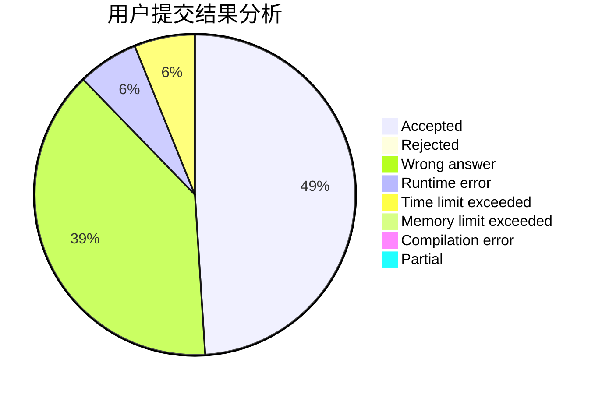
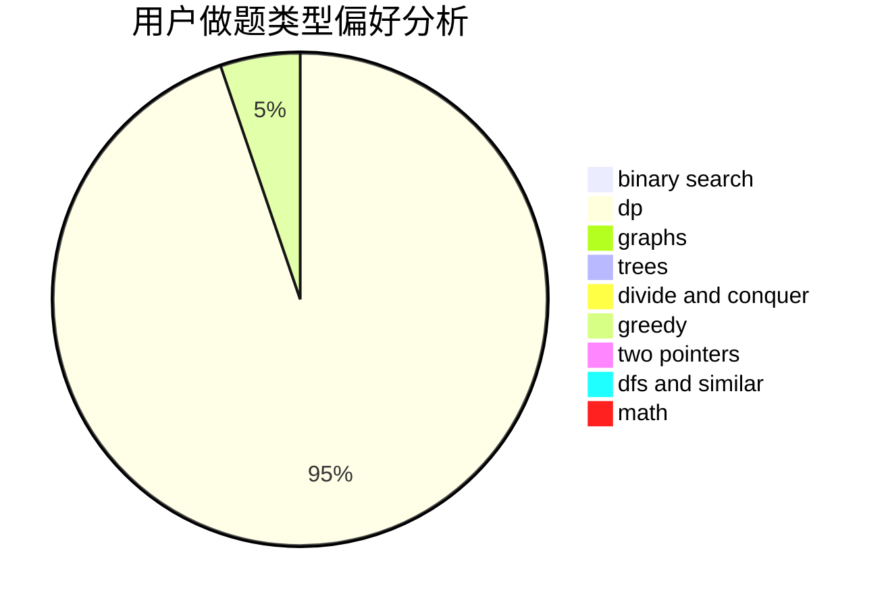

# zby0327

<!-- tabs:start -->

#### **用户提交结果分析**

#### **用户做题类型偏好分析**

<!-- tabs:end -->
# 推荐题目
[1350D](https://codeforces.com/contest/1350/problem/D)
[702B](https://codeforces.com/contest/702/problem/B)
[1262E](https://codeforces.com/contest/1262/problem/E)
[510D](https://codeforces.com/contest/510/problem/D)
[1496C](https://codeforces.com/contest/1496/problem/C)
[1499E](https://codeforces.com/contest/1499/problem/E)
[1490C](https://codeforces.com/contest/1490/problem/C)
[1497B](https://codeforces.com/contest/1497/problem/B)
[1491C](https://codeforces.com/contest/1491/problem/C)
[1484C](https://codeforces.com/contest/1484/problem/C)
