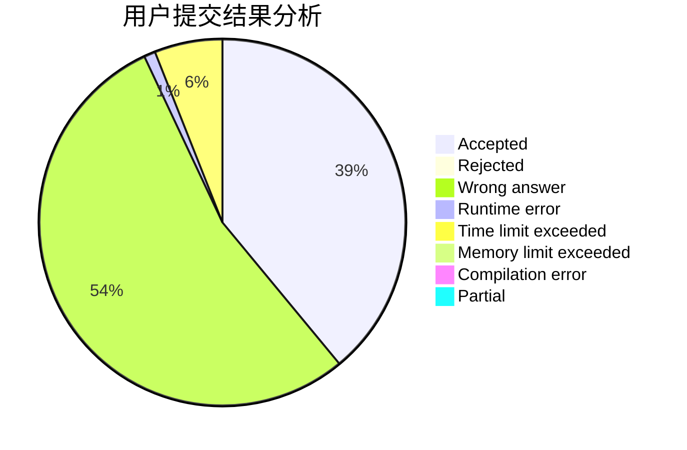
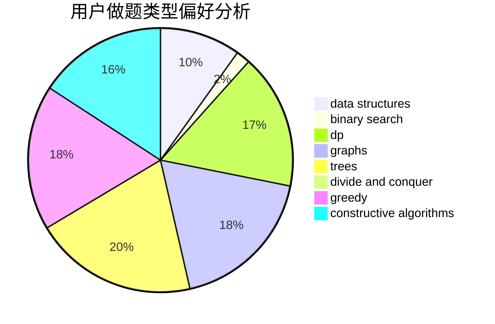
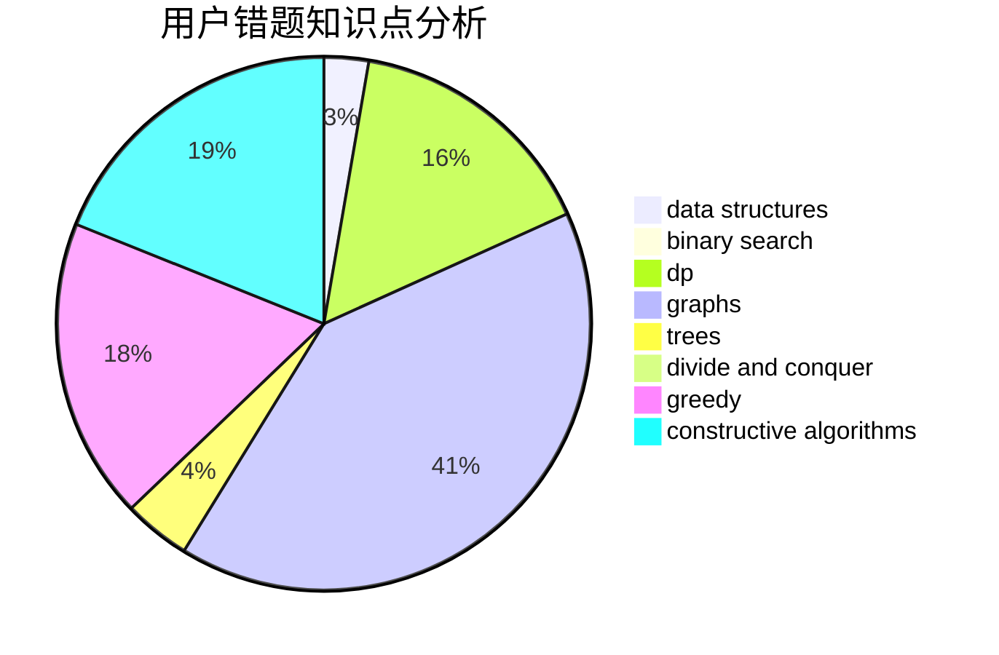

# zclong

<!-- tabs:start -->

#### **用户提交结果分析**

#### **用户做题类型偏好分析**

#### **用户错题知识点分析**

<!-- tabs:end -->
# 推荐题目
[677A](https://codeforces.com/contest/677/problem/A)		implementation		  
[958F3](https://codeforces.com/contest/958F/problem/3)		fft		  
[283D](https://codeforces.com/contest/283/problem/D)		dp,
                        math,
                        number theory		  
[343C](https://codeforces.com/contest/343/problem/C)		binary search,
                        greedy,
                        two pointers		  
[337C](https://codeforces.com/contest/337/problem/C)		binary search,
                        greedy,
                        math,
                        matrices,
                        number theory		  
[519B](https://codeforces.com/contest/519/problem/B)		data structures,
                        implementation,
                        sortings		  
[1292F](https://codeforces.com/contest/1292/problem/F)		bitmasks,
                        combinatorics,
                        dp		  
[424B](https://codeforces.com/contest/424/problem/B)		binary search,
                        greedy,
                        implementation,
                        sortings		  
[1328D](https://codeforces.com/contest/1328/problem/D)		constructive algorithms,
                        dp,
                        graphs,
                        greedy,
                        math		  
[847B](https://codeforces.com/contest/847/problem/B)		binary search,
                        data structures		  
