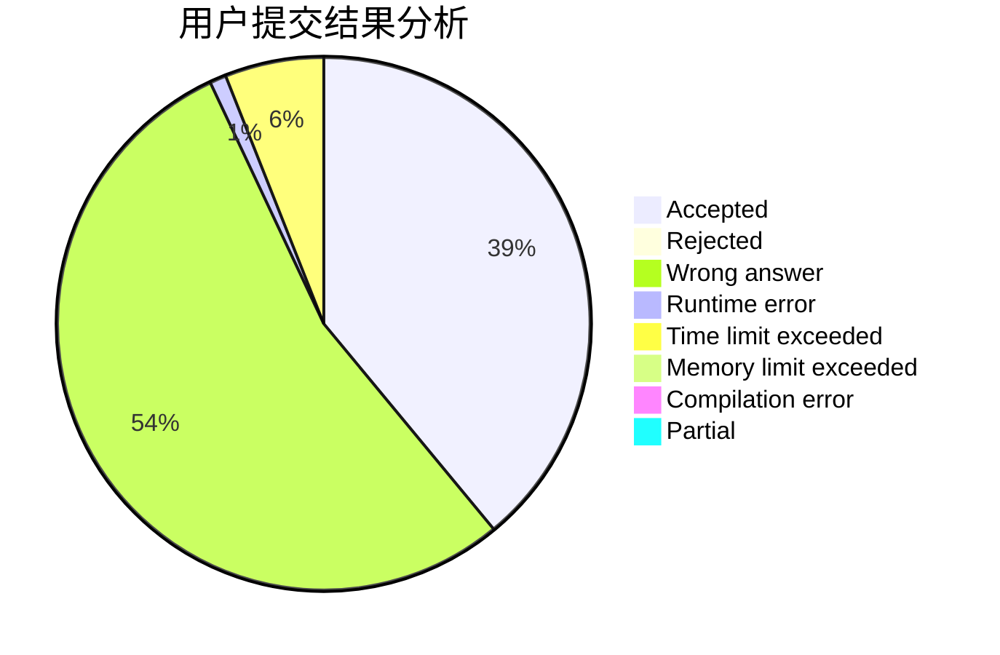
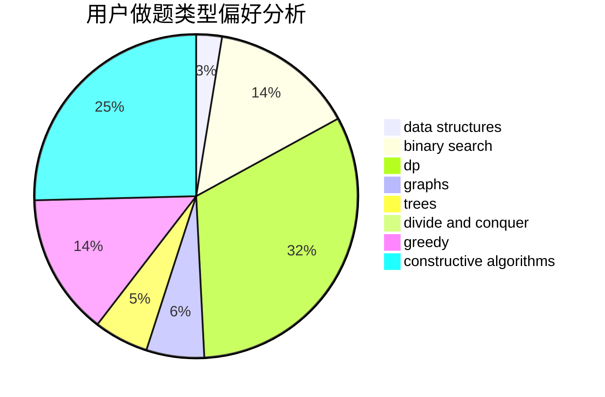
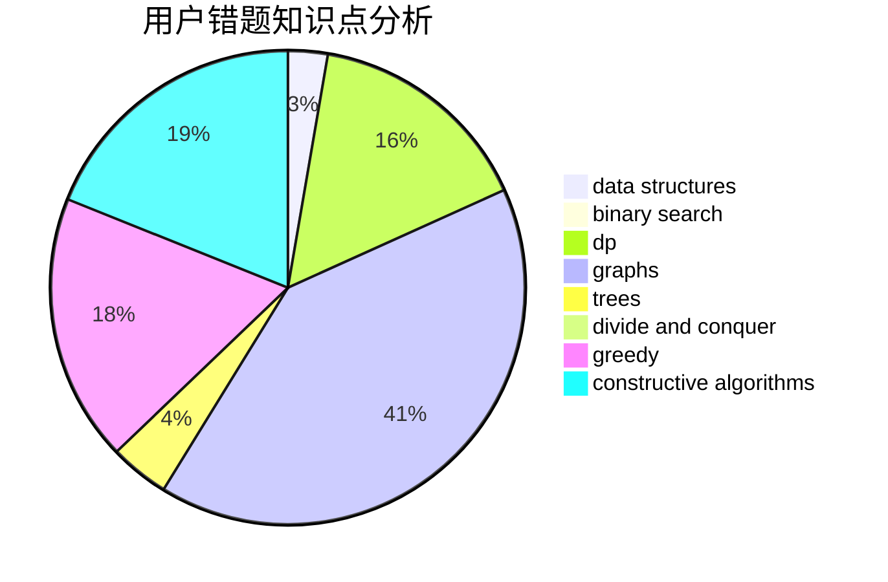

# zclong

<!-- tabs:start -->

#### **用户提交结果分析**

#### **用户做题类型偏好分析**

#### **用户错题知识点分析**

<!-- tabs:end -->
# 推荐题目
[701A](https://codeforces.com/contest/701/problem/A)		greedy,
                        implementation		  
[980D](https://codeforces.com/contest/980/problem/D)		dp,
                        math,
                        number theory		  
[29D](https://codeforces.com/contest/29/problem/D)		constructive algorithms,
                        dfs and similar,
                        trees		  
[36D](https://codeforces.com/contest/36/problem/D)		games		  
[364A](https://codeforces.com/contest/364/problem/A)		combinatorics,
                        data structures,
                        implementation		  
[544D](https://codeforces.com/contest/544/problem/D)		dsu,graphs,sortings,trees		  
[12A](https://codeforces.com/contest/12/problem/A)		implementation		  
[447A](https://codeforces.com/contest/447/problem/A)		implementation		  
[1334G](https://codeforces.com/contest/1334/problem/G)		bitmasks,
                        brute force,
                        fft		  
[865B](https://codeforces.com/contest/865/problem/B)		binary search,
                        sortings,
                        ternary search		  
