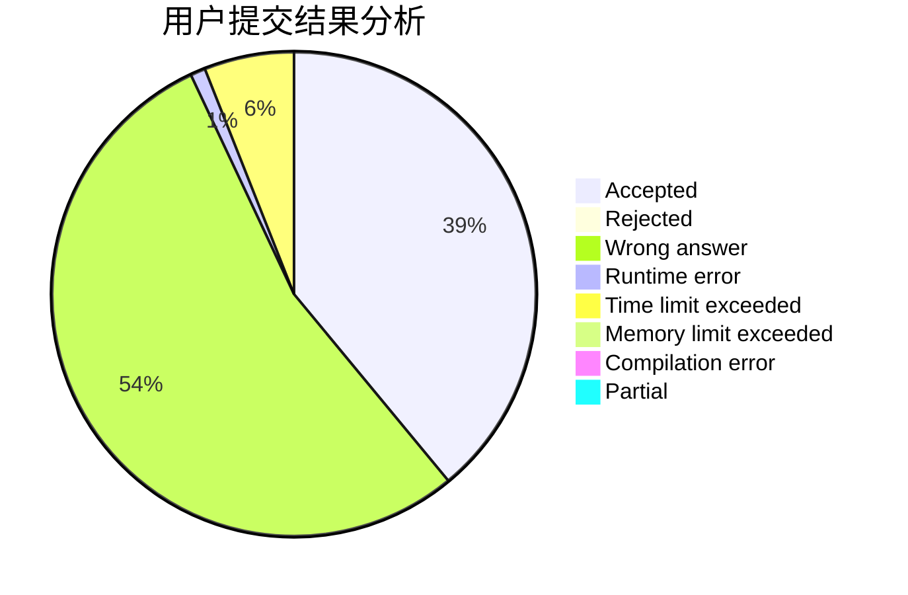
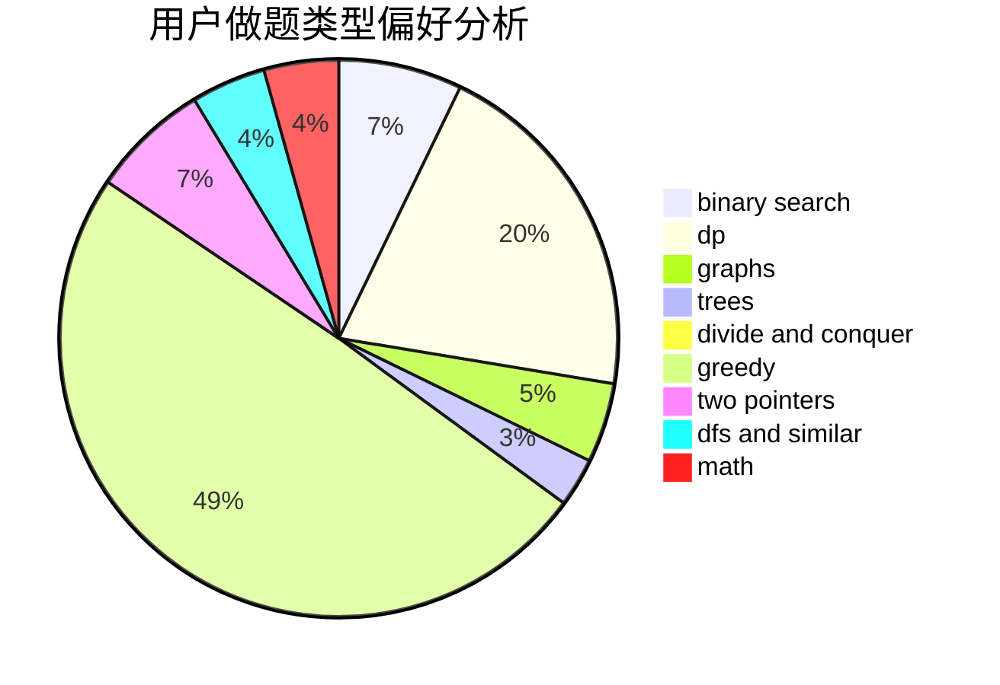

# zclong

<!-- tabs:start -->

#### **用户提交结果分析**

#### **用户做题类型偏好分析**

<!-- tabs:end -->
# 推荐题目
[701A](https://codeforces.com/contest/701/problem/A)
[980D](https://codeforces.com/contest/980/problem/D)
[29D](https://codeforces.com/contest/29/problem/D)
[36D](https://codeforces.com/contest/36/problem/D)
[364A](https://codeforces.com/contest/364/problem/A)
[544D](https://codeforces.com/contest/544/problem/D)
[12A](https://codeforces.com/contest/12/problem/A)
[447A](https://codeforces.com/contest/447/problem/A)
[1334G](https://codeforces.com/contest/1334/problem/G)
[865B](https://codeforces.com/contest/865/problem/B)
