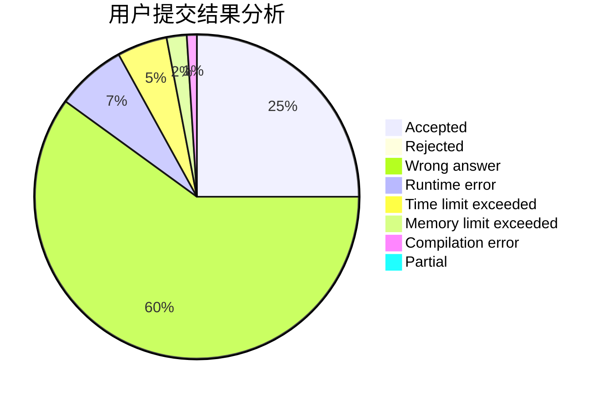
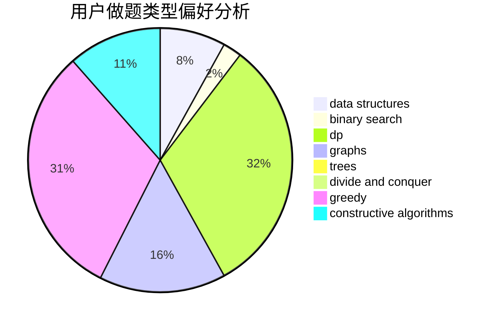
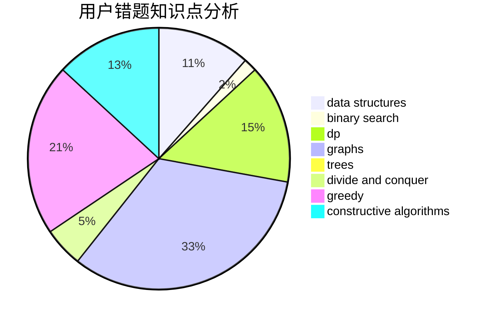

# zech

<!-- tabs:start -->

#### **用户提交结果分析**

#### **用户做题类型偏好分析**

#### **用户错题知识点分析**

<!-- tabs:end -->
# 推荐题目
[952A](https://codeforces.com/contest/952/problem/A)		math		  
[794B](https://codeforces.com/contest/794/problem/B)		geometry,
                        math		  
[626D](https://codeforces.com/contest/626/problem/D)		brute force,
                        combinatorics,
                        dp,
                        probabilities		  
[809B](https://codeforces.com/contest/809/problem/B)		binary search,
                        interactive		  
[471A](https://codeforces.com/contest/471/problem/A)		implementation		  
[1045G](https://codeforces.com/contest/1045/problem/G)		data structures		  
[1372B](https://codeforces.com/contest/1372/problem/B)		greedy,
                        math,
                        number theory		  
[39D](https://codeforces.com/contest/39/problem/D)		math		  
[1005B](https://codeforces.com/contest/1005/problem/B)		brute force,
                        implementation,
                        strings		  
[884A](https://codeforces.com/contest/884/problem/A)		implementation		  
