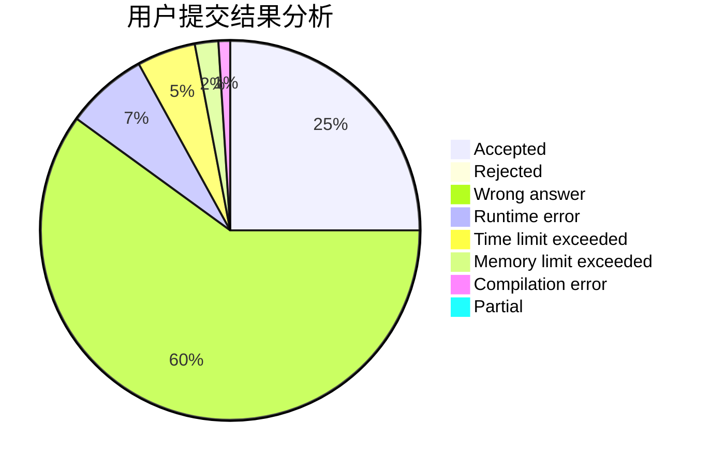
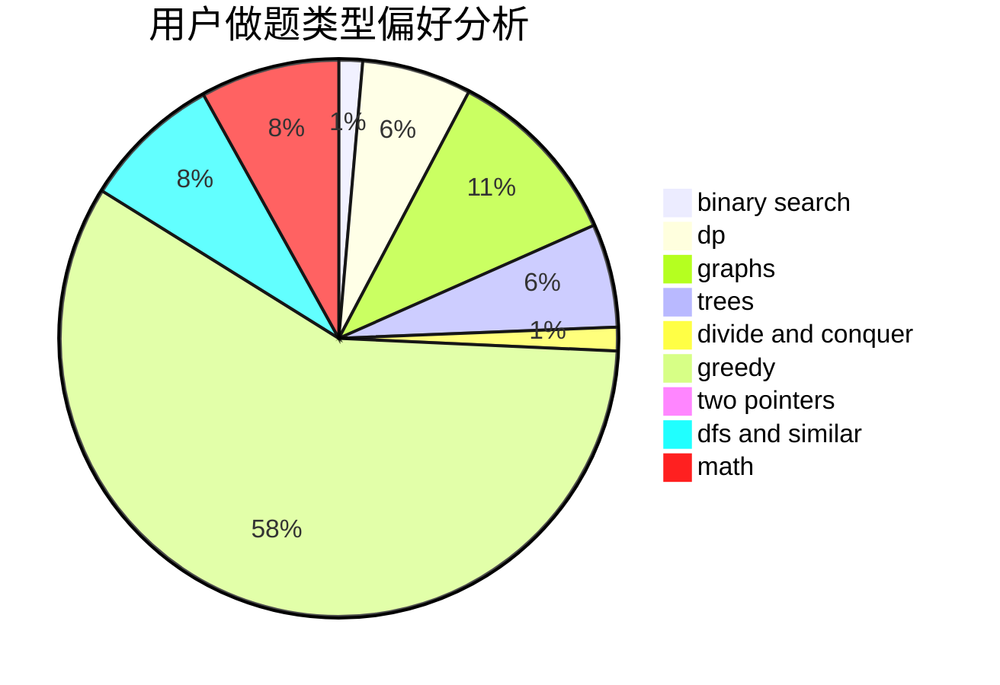

# zech

<!-- tabs:start -->

#### **用户提交结果分析**

#### **用户做题类型偏好分析**

<!-- tabs:end -->
# 推荐题目
[96B](https://codeforces.com/contest/96/problem/B)
[809C](https://codeforces.com/contest/809/problem/C)
[652E](https://codeforces.com/contest/652/problem/E)
[827A](https://codeforces.com/contest/827/problem/A)
[489F](https://codeforces.com/contest/489/problem/F)
[1045J](https://codeforces.com/contest/1045/problem/J)
[1380G](https://codeforces.com/contest/1380/problem/G)
[426B](https://codeforces.com/contest/426/problem/B)
[1005C](https://codeforces.com/contest/1005/problem/C)
[902B](https://codeforces.com/contest/902/problem/B)
