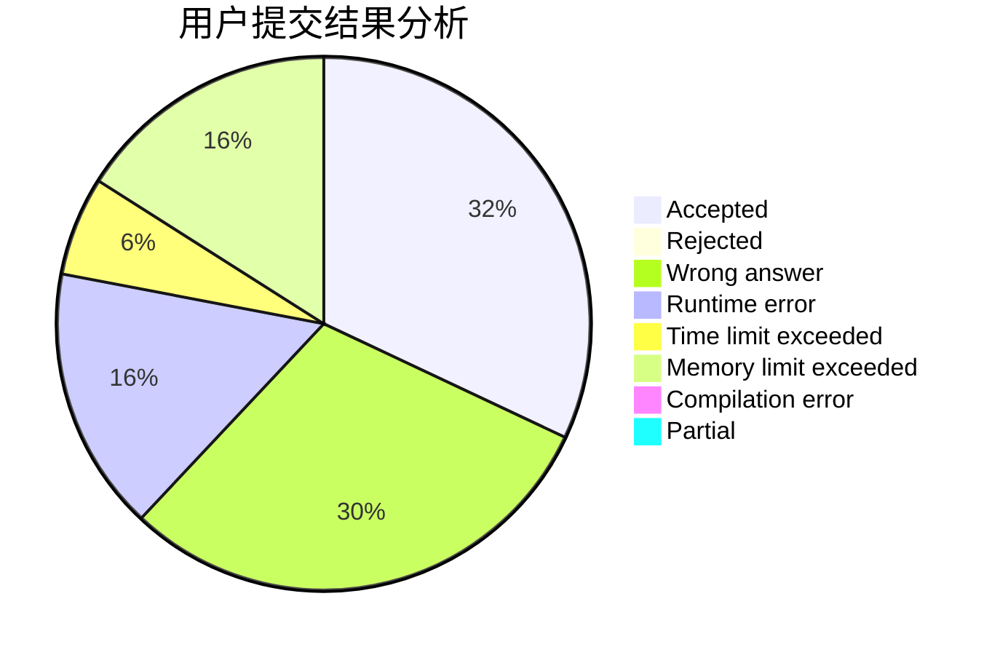
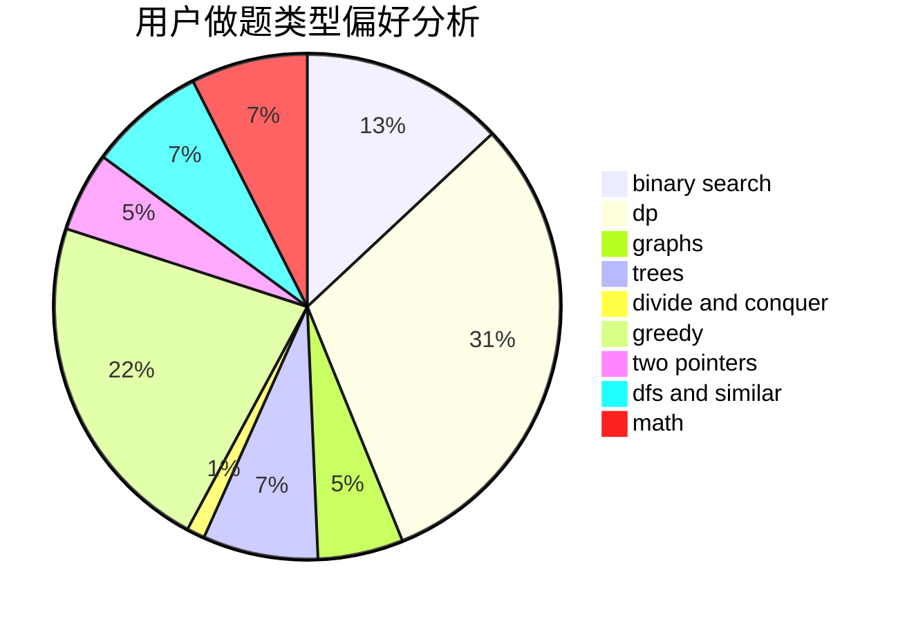

# zeda_

<!-- tabs:start -->

#### **用户提交结果分析**

#### **用户做题类型偏好分析**

<!-- tabs:end -->
# 推荐题目
[1399F](https://codeforces.com/contest/1399/problem/F)
[421A](https://codeforces.com/contest/421/problem/A)
[291A](https://codeforces.com/contest/291/problem/A)
[1350E](https://codeforces.com/contest/1350/problem/E)
[814C](https://codeforces.com/contest/814/problem/C)
[1040A](https://codeforces.com/contest/1040/problem/A)
[631D](https://codeforces.com/contest/631/problem/D)
[699C](https://codeforces.com/contest/699/problem/C)
[459C](https://codeforces.com/contest/459/problem/C)
[834B](https://codeforces.com/contest/834/problem/B)
