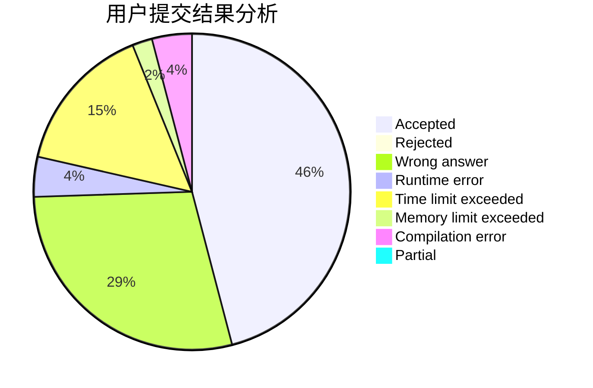
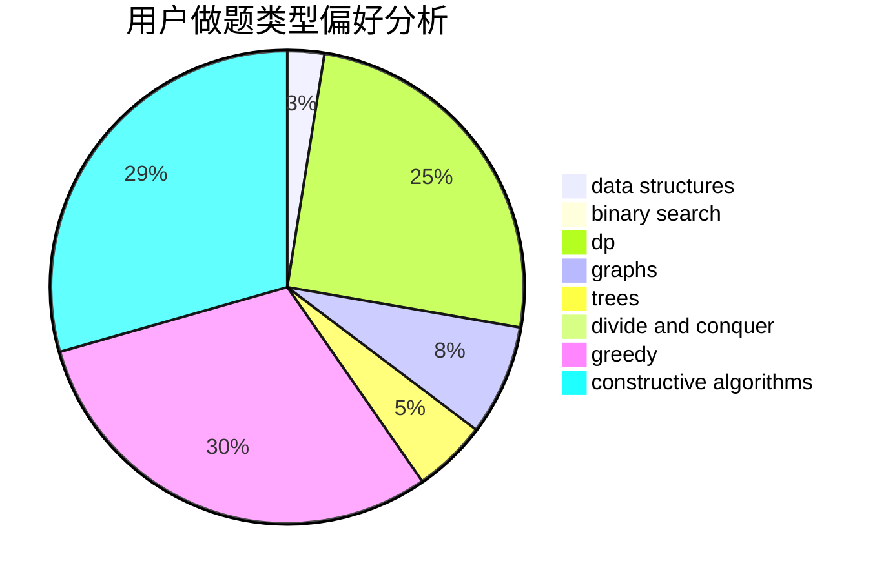

# zekrom_dream

<!-- tabs:start -->

#### **用户提交结果分析**

#### **用户做题类型偏好分析**

#### **用户错题知识点分析**

<!-- tabs:end -->
# 推荐题目
[1349E](https://codeforces.com/contest/1349/problem/E)		constructive algorithms,
                        dp,
                        greedy		  
[1104C](https://codeforces.com/contest/1104/problem/C)		dsu,graphs,sortings,trees		  
[887D](https://codeforces.com/contest/887/problem/D)		data structures,
                        two pointers		  
[128C](https://codeforces.com/contest/128/problem/C)		combinatorics,
                        dp		  
[140C](https://codeforces.com/contest/140/problem/C)		binary search,
                        data structures,
                        greedy		  
[735E](https://codeforces.com/contest/735/problem/E)		dp,
                        trees		  
[231A](https://codeforces.com/contest/231/problem/A)		brute force,
                        greedy		  
[838B](https://codeforces.com/contest/838/problem/B)		data structures,
                        dfs and similar,
                        trees		  
[482B](https://codeforces.com/contest/482/problem/B)		constructive algorithms,
                        data structures,
                        trees		  
[713C](https://codeforces.com/contest/713/problem/C)		dp,
                        sortings		  
