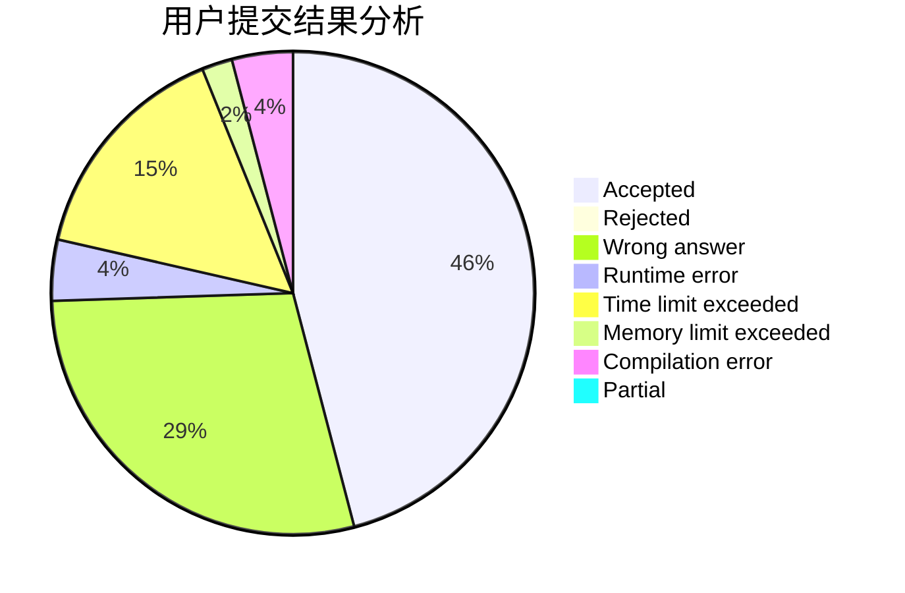
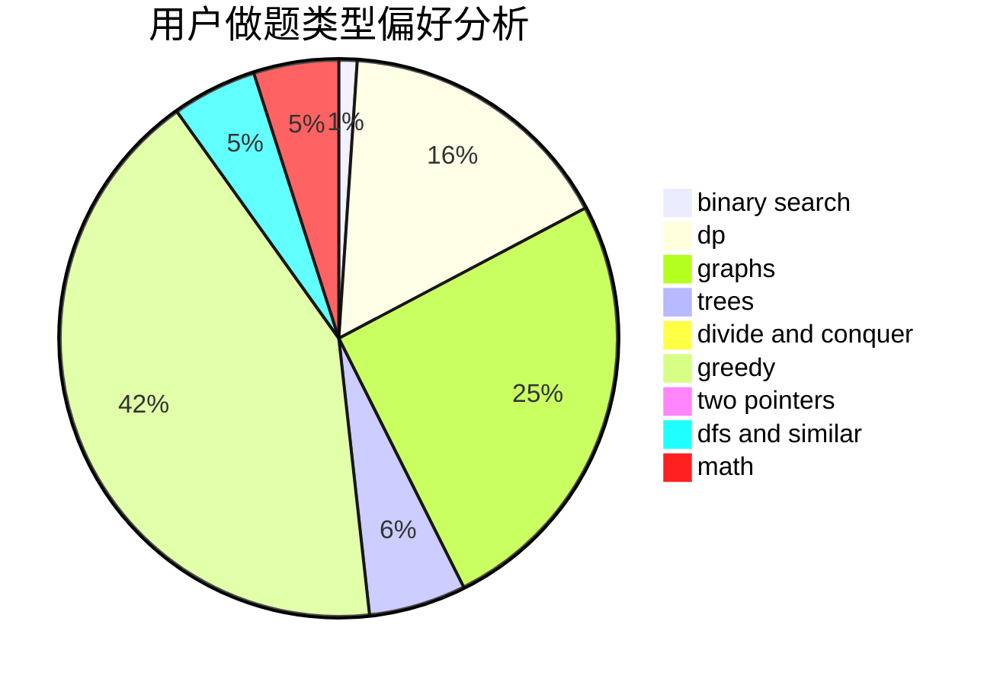

# zekrom_dream

<!-- tabs:start -->

#### **用户提交结果分析**

#### **用户做题类型偏好分析**

<!-- tabs:end -->
# 推荐题目
[1349E](https://codeforces.com/contest/1349/problem/E)
[1104C](https://codeforces.com/contest/1104/problem/C)
[887D](https://codeforces.com/contest/887/problem/D)
[128C](https://codeforces.com/contest/128/problem/C)
[140C](https://codeforces.com/contest/140/problem/C)
[735E](https://codeforces.com/contest/735/problem/E)
[231A](https://codeforces.com/contest/231/problem/A)
[838B](https://codeforces.com/contest/838/problem/B)
[482B](https://codeforces.com/contest/482/problem/B)
[713C](https://codeforces.com/contest/713/problem/C)
