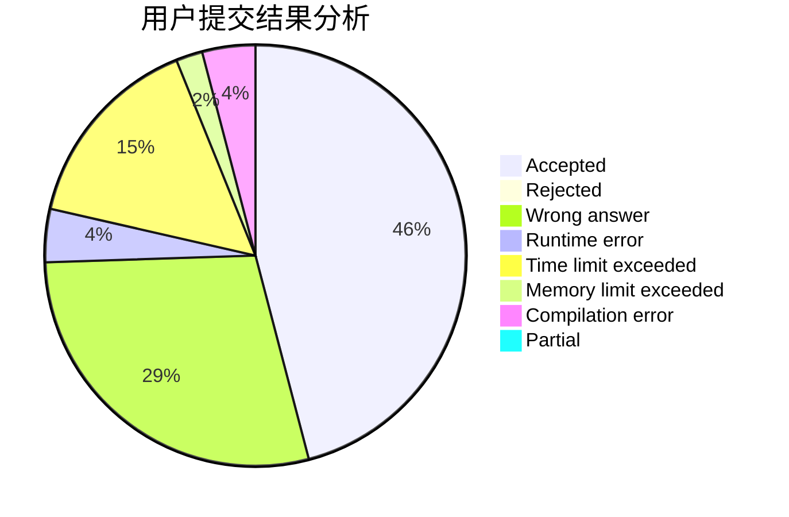
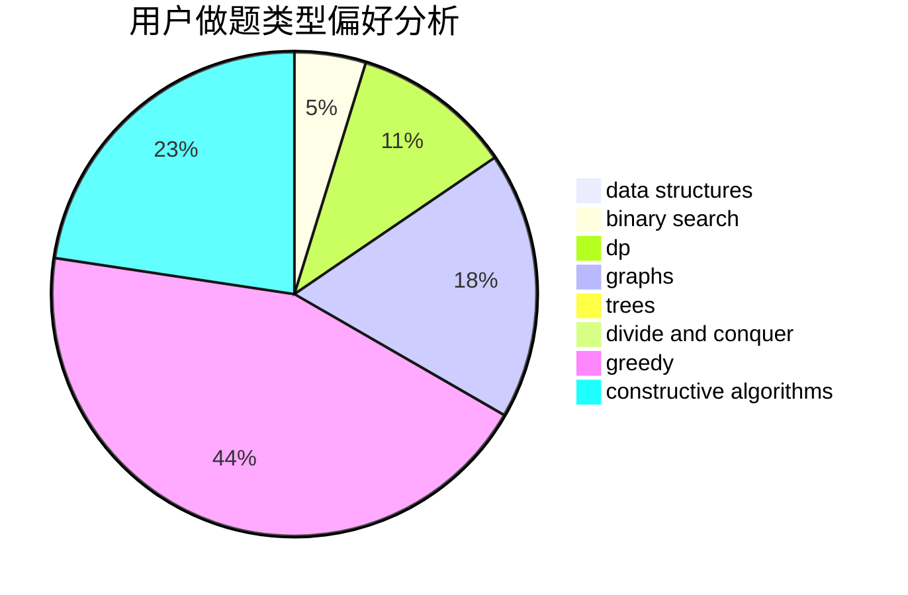

# zekrom_dream

<!-- tabs:start -->

#### **用户提交结果分析**

#### **用户做题类型偏好分析**

#### **用户错题知识点分析**

<!-- tabs:end -->
# 推荐题目
[1343A](https://codeforces.com/contest/1343/problem/A)		brute force,
                        math		  
[1103E](https://codeforces.com/contest/1103/problem/E)		fft,
                        math,
                        number theory		  
[868B](https://codeforces.com/contest/868/problem/B)		implementation		  
[1282E](https://codeforces.com/contest/1282/problem/E)		constructive algorithms,
                        data structures,
                        dfs and similar,
                        graphs		  
[1400D](https://codeforces.com/contest/1400/problem/D)		brute force,
                        combinatorics,
                        data structures,
                        math,
                        two pointers		  
[718D](https://codeforces.com/contest/718/problem/D)		dp,
                        hashing,
                        trees		  
[208E](https://codeforces.com/contest/208/problem/E)		binary search,
                        data structures,
                        dfs and similar,
                        trees		  
[818C](https://codeforces.com/contest/818/problem/C)		brute force,
                        implementation		  
[462B](https://codeforces.com/contest/462/problem/B)		greedy		  
[696D](https://codeforces.com/contest/696/problem/D)		data structures,
                        dp,
                        matrices,
                        strings		  
