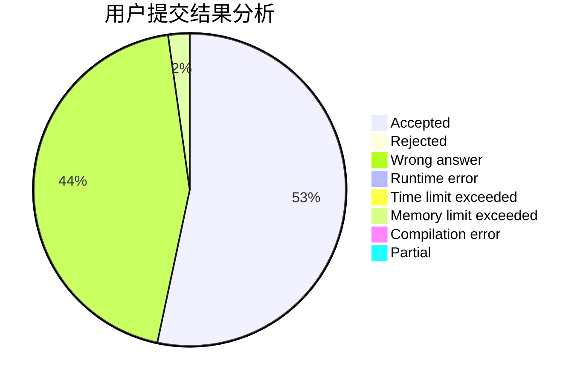
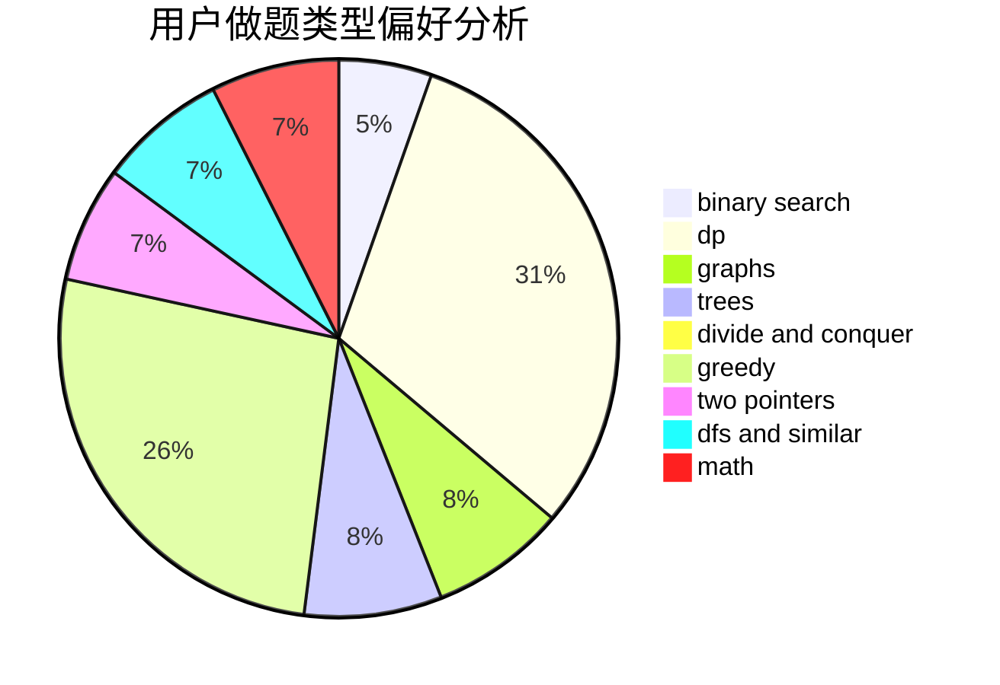

# zengzhangtianwang

<!-- tabs:start -->

#### **用户提交结果分析**

#### **用户做题类型偏好分析**

<!-- tabs:end -->
# 推荐题目
[1430A](https://codeforces.com/contest/1430/problem/A)
[1454B](https://codeforces.com/contest/1454/problem/B)
[831C](https://codeforces.com/contest/831/problem/C)
[1454E](https://codeforces.com/contest/1454/problem/E)
[231E](https://codeforces.com/contest/231/problem/E)
[605A](https://codeforces.com/contest/605/problem/A)
[424C](https://codeforces.com/contest/424/problem/C)
[1324A](https://codeforces.com/contest/1324/problem/A)
[371D](https://codeforces.com/contest/371/problem/D)
[1093E](https://codeforces.com/contest/1093/problem/E)
