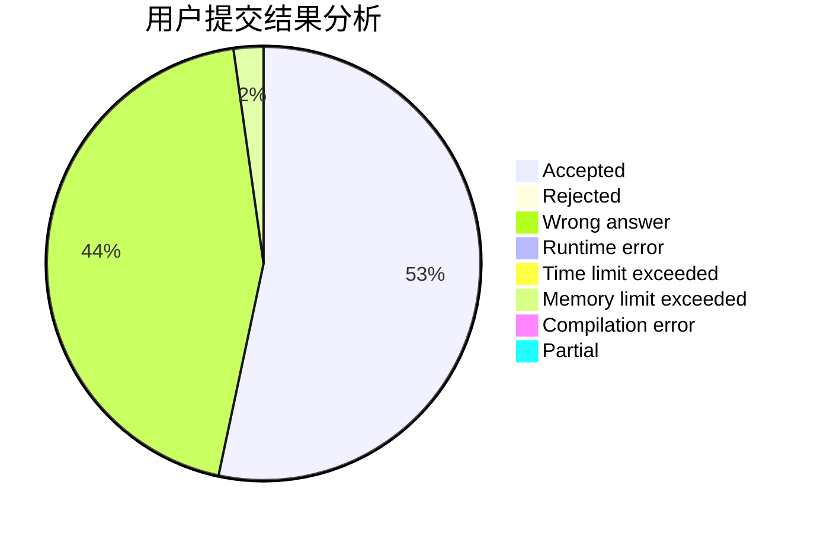
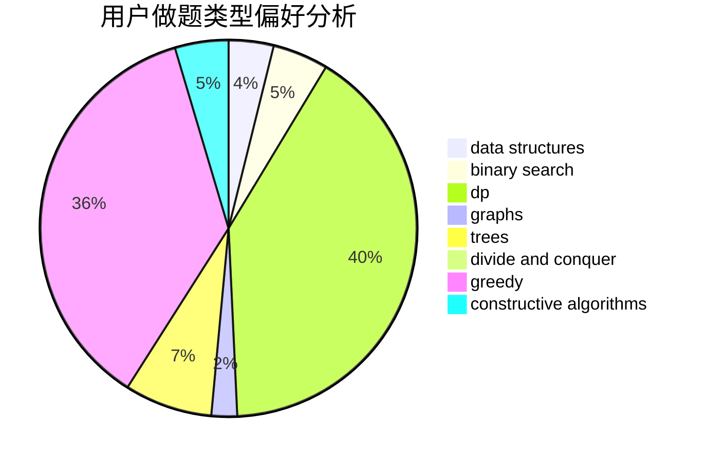
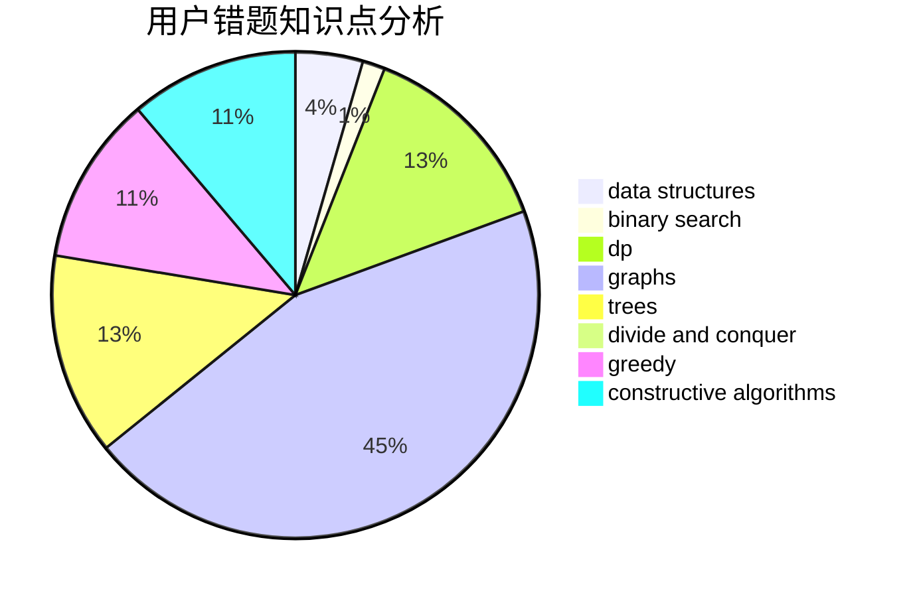

# zengzhangtianwang

<!-- tabs:start -->

#### **用户提交结果分析**

#### **用户做题类型偏好分析**

#### **用户错题知识点分析**

<!-- tabs:end -->
# 推荐题目
[1430A](https://codeforces.com/contest/1430/problem/A)		brute force,
                        constructive algorithms,
                        math		  
[1454B](https://codeforces.com/contest/1454/problem/B)		implementation		  
[831C](https://codeforces.com/contest/831/problem/C)		brute force,
                        constructive algorithms		  
[1454E](https://codeforces.com/contest/1454/problem/E)		combinatorics,
                        dfs and similar,
                        graphs,
                        trees		  
[231E](https://codeforces.com/contest/231/problem/E)		data structures,
                        dfs and similar,
                        dp,
                        graphs,
                        trees		  
[605A](https://codeforces.com/contest/605/problem/A)		constructive algorithms,
                        greedy		  
[424C](https://codeforces.com/contest/424/problem/C)		math		  
[1324A](https://codeforces.com/contest/1324/problem/A)		implementation,
                        number theory		  
[371D](https://codeforces.com/contest/371/problem/D)		data structures,
                        dsu,
                        implementation,
                        trees		  
[1093E](https://codeforces.com/contest/1093/problem/E)		data structures		  
