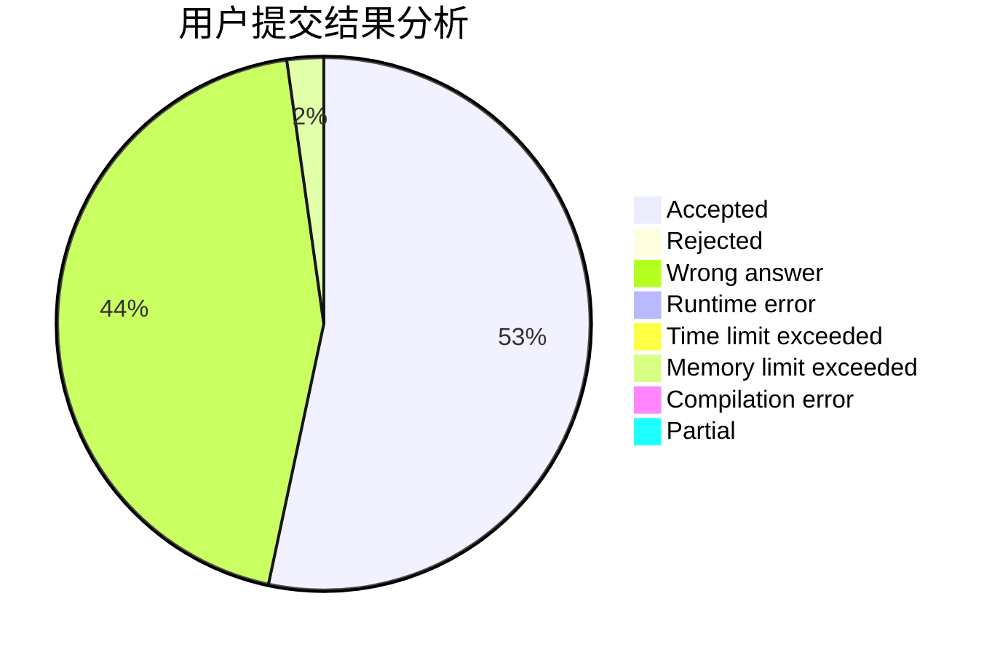
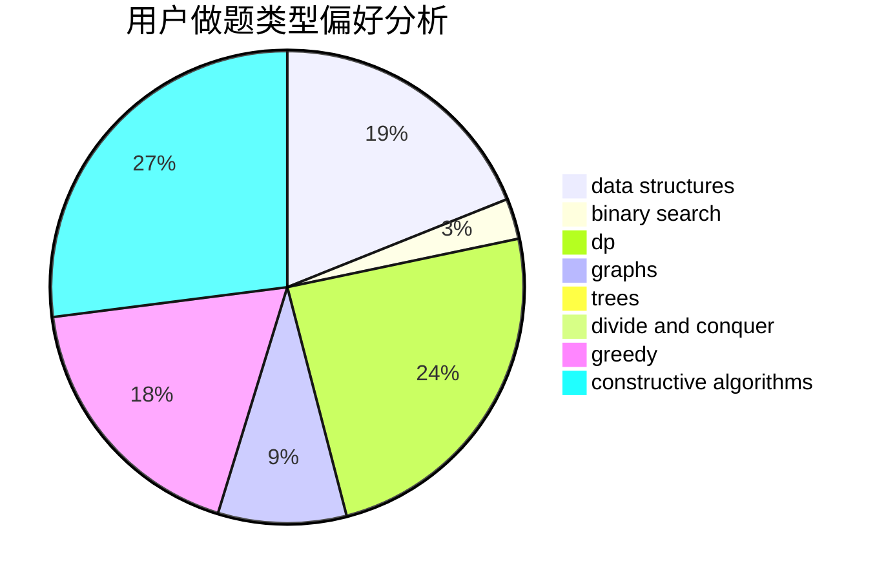
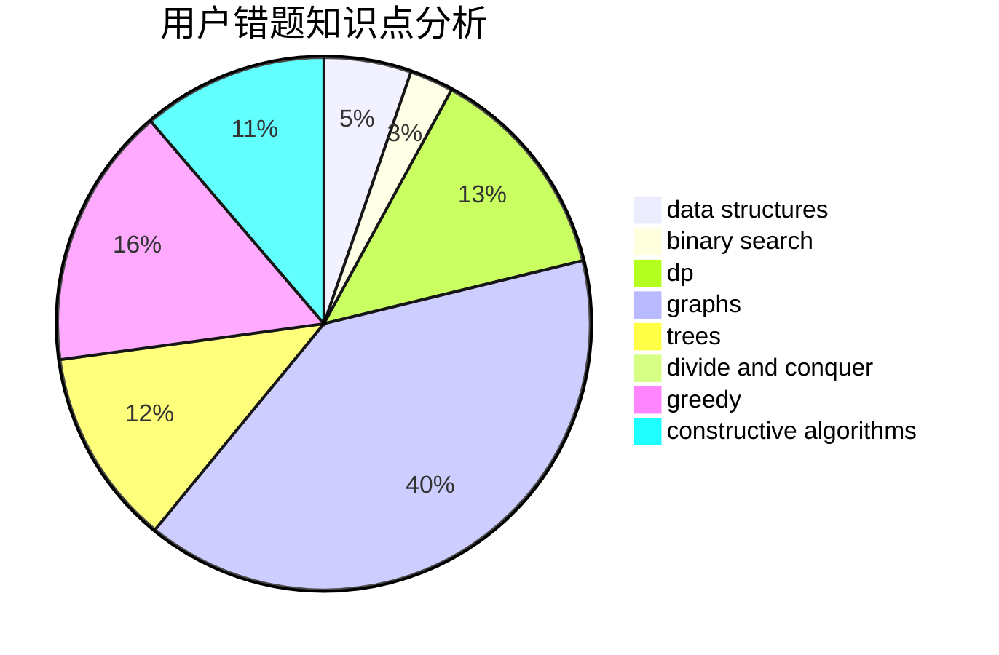

# zengzhangtianwang

<!-- tabs:start -->

#### **用户提交结果分析**

#### **用户做题类型偏好分析**

#### **用户错题知识点分析**

<!-- tabs:end -->
# 推荐题目
[1422C](https://codeforces.com/contest/1422/problem/C)		combinatorics,
                        dp,
                        math		  
[1444D](https://codeforces.com/contest/1444/problem/D)		constructive algorithms,
                        dp,
                        geometry		  
[813A](https://codeforces.com/contest/813/problem/A)		implementation		  
[1445B](https://codeforces.com/contest/1445/problem/B)		greedy,
                        math		  
[20C](https://codeforces.com/contest/20/problem/C)		graphs,
                        shortest paths		  
[584D](https://codeforces.com/contest/584/problem/D)		brute force,
                        math,
                        number theory		  
[397E](https://codeforces.com/contest/397/problem/E)		dsu,graphs,sortings,trees		  
[1314B](https://codeforces.com/contest/1314/problem/B)		dsu,graphs,sortings,trees		  
[346A](https://codeforces.com/contest/346/problem/A)		games,
                        math,
                        number theory		  
[1093B](https://codeforces.com/contest/1093/problem/B)		constructive algorithms,
                        greedy,
                        sortings,
                        strings		  
