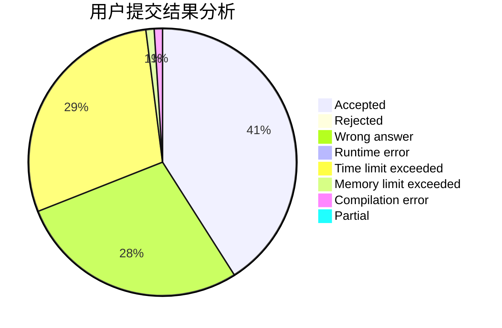
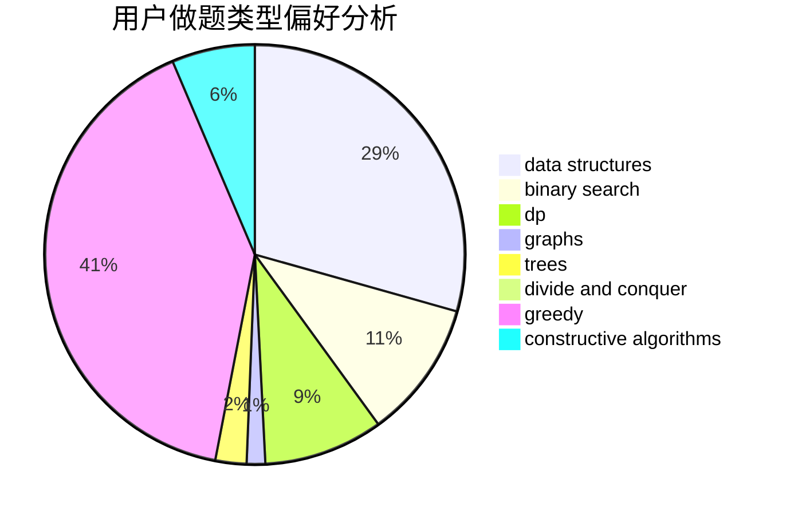

# zerotrac

<!-- tabs:start -->

#### **用户提交结果分析**

#### **用户做题类型偏好分析**

#### **用户错题知识点分析**

<!-- tabs:end -->
# 推荐题目
[1487A](https://codeforces.com/contest/1487/problem/A)		implementation,
                        sortings		  
[1096F](https://codeforces.com/contest/1096/problem/F)		dp,
                        math,
                        probabilities		  
[1416B](https://codeforces.com/contest/1416/problem/B)		constructive algorithms,
                        greedy,
                        math		  
[679E](https://codeforces.com/contest/679/problem/E)		data structures		  
[382E](https://codeforces.com/contest/382/problem/E)		combinatorics,
                        dp		  
[1030B](https://codeforces.com/contest/1030/problem/B)		geometry		  
[1367E](https://codeforces.com/contest/1367/problem/E)		brute force,
                        dfs and similar,
                        dp,
                        graphs,
                        greedy,
                        number theory		  
[160D](https://codeforces.com/contest/160/problem/D)		dfs and similar,
                        dsu,
                        graphs,
                        sortings		  
[665F](https://codeforces.com/contest/665/problem/F)		data structures,
                        dp,
                        math,
                        number theory,
                        sortings,
                        two pointers		  
[12471](https://codeforces.com/contest/1247/problem/1)		dsu,graphs,sortings,trees		  
