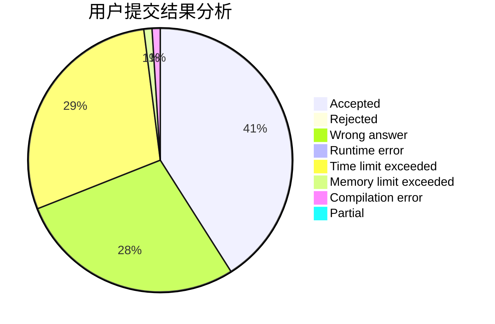
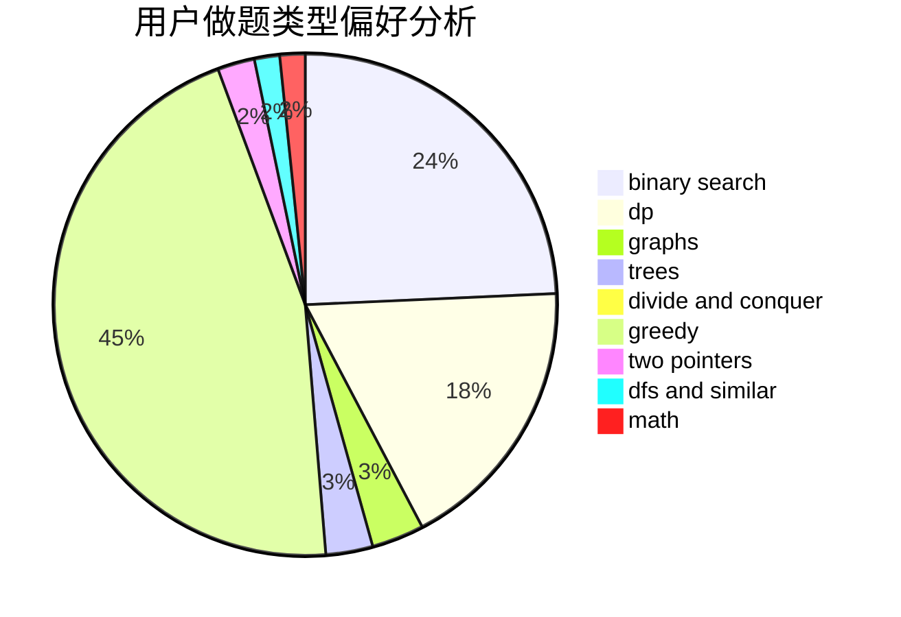

# zerotrac

<!-- tabs:start -->

#### **用户提交结果分析**

#### **用户做题类型偏好分析**

<!-- tabs:end -->
# 推荐题目
[1487A](https://codeforces.com/contest/1487/problem/A)
[1096F](https://codeforces.com/contest/1096/problem/F)
[1416B](https://codeforces.com/contest/1416/problem/B)
[679E](https://codeforces.com/contest/679/problem/E)
[382E](https://codeforces.com/contest/382/problem/E)
[1030B](https://codeforces.com/contest/1030/problem/B)
[1367E](https://codeforces.com/contest/1367/problem/E)
[160D](https://codeforces.com/contest/160/problem/D)
[665F](https://codeforces.com/contest/665/problem/F)
[12471](https://codeforces.com/contest/1247/problem/1)
