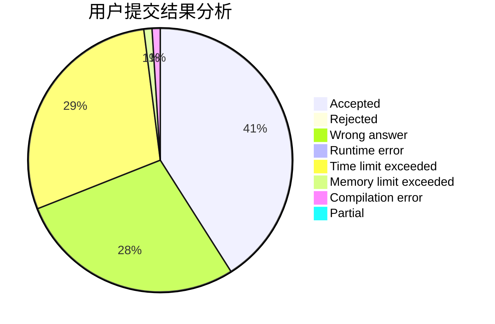
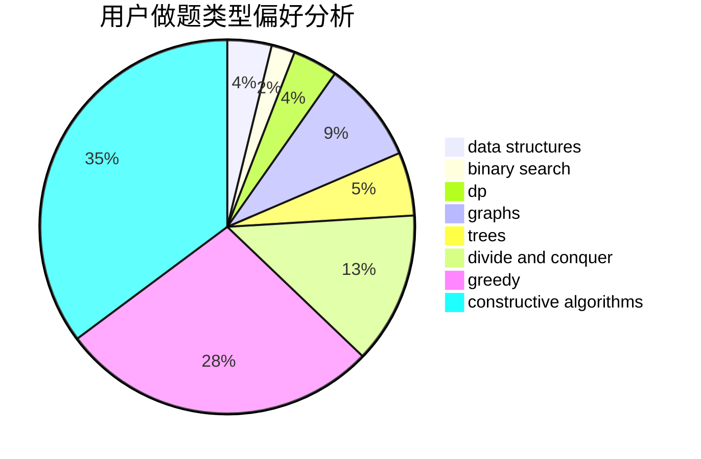

# zerotrac

<!-- tabs:start -->

#### **用户提交结果分析**

#### **用户做题类型偏好分析**

#### **用户错题知识点分析**

<!-- tabs:end -->
# 推荐题目
[1478C](https://codeforces.com/contest/1478/problem/C)		implementation,
                        math,
                        sortings		  
[1096C](https://codeforces.com/contest/1096/problem/C)		brute force,
                        geometry		  
[1405A](https://codeforces.com/contest/1405/problem/A)		constructive algorithms		  
[659E](https://codeforces.com/contest/659/problem/E)		data structures,
                        dfs and similar,
                        dsu,
                        graphs,
                        greedy		  
[356D](https://codeforces.com/contest/356/problem/D)		bitmasks,
                        constructive algorithms,
                        dp,
                        greedy		  
[102A](https://codeforces.com/contest/102/problem/A)		brute force		  
[1359F](https://codeforces.com/contest/1359/problem/F)		binary search,
                        brute force,
                        data structures,
                        geometry,
                        math		  
[1509F](https://codeforces.com/contest/1509/problem/F)		dsu,graphs,sortings,trees		  
[633D](https://codeforces.com/contest/633/problem/D)		brute force,
                        dp,
                        hashing,
                        implementation,
                        math		  
[1241C](https://codeforces.com/contest/1241/problem/C)		dsu,graphs,sortings,trees		  
