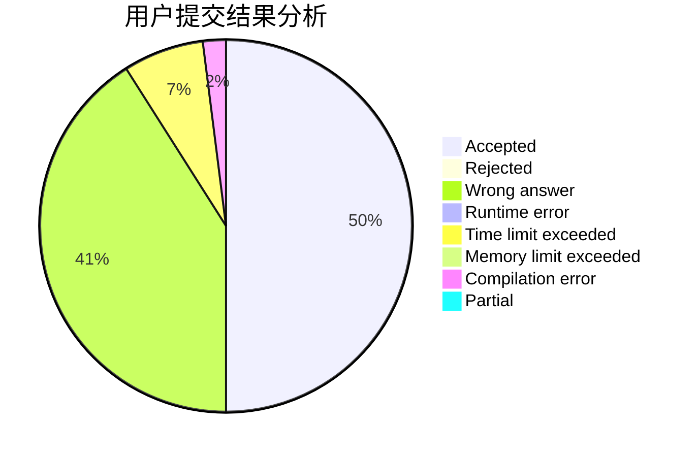
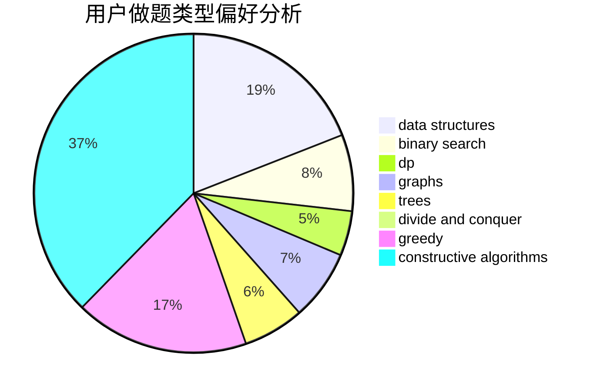
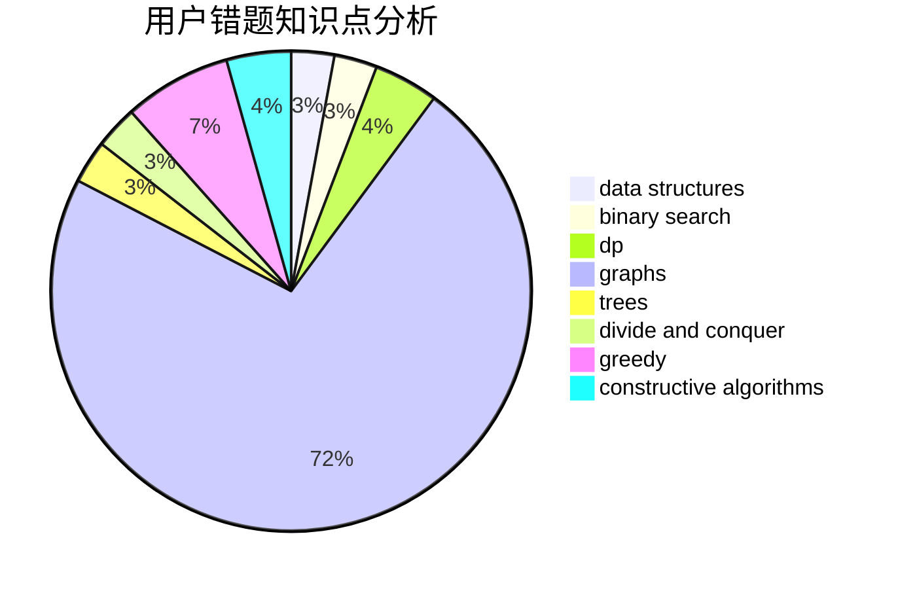

# zexushi

<!-- tabs:start -->

#### **用户提交结果分析**

#### **用户做题类型偏好分析**

#### **用户错题知识点分析**

<!-- tabs:end -->
# 推荐题目
[14392](https://codeforces.com/contest/1439/problem/2)		dsu,graphs,sortings,trees		  
[1129D](https://codeforces.com/contest/1129/problem/D)		data structures,
                        dp		  
[1265C](https://codeforces.com/contest/1265/problem/C)		dsu,graphs,sortings,trees		  
[847E](https://codeforces.com/contest/847/problem/E)		binary search,
                        dp		  
[1220E](https://codeforces.com/contest/1220/problem/E)		dfs and similar,
                        dp,
                        dsu,
                        graphs,
                        greedy,
                        trees		  
[121E](https://codeforces.com/contest/121/problem/E)		data structures		  
[59E](https://codeforces.com/contest/59/problem/E)		graphs,
                        shortest paths		  
[650D](https://codeforces.com/contest/650/problem/D)		binary search,
                        data structures,
                        dp,
                        hashing		  
[633D](https://codeforces.com/contest/633/problem/D)		brute force,
                        dp,
                        hashing,
                        implementation,
                        math		  
[1078D](https://codeforces.com/contest/1078/problem/D)		dsu,graphs,sortings,trees		  
