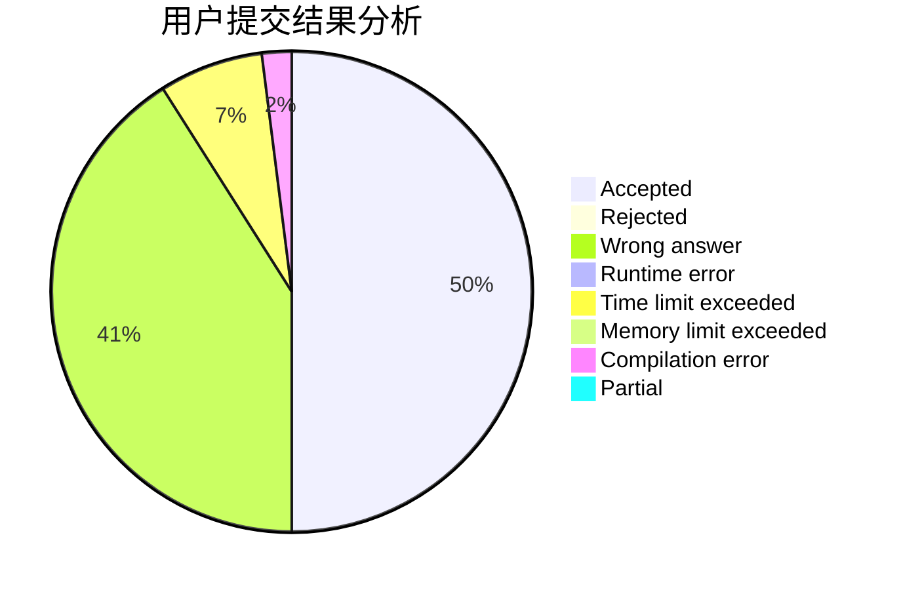
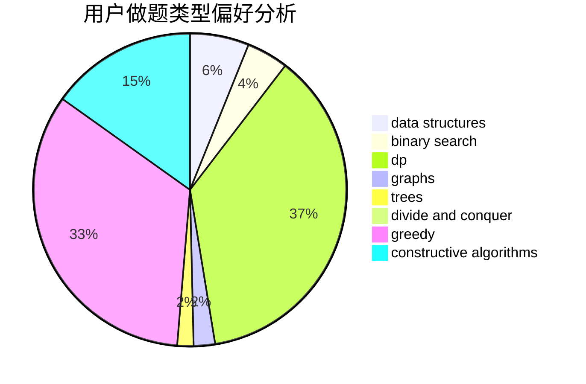
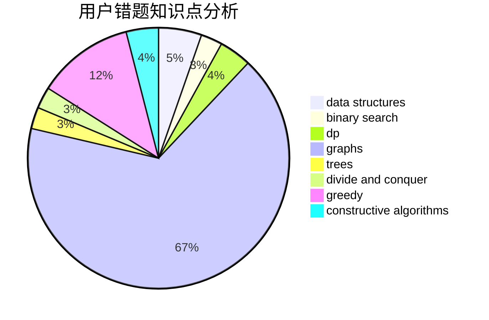

# zexushi

<!-- tabs:start -->

#### **用户提交结果分析**

#### **用户做题类型偏好分析**

#### **用户错题知识点分析**

<!-- tabs:end -->
# 推荐题目
[1430C](https://codeforces.com/contest/1430/problem/C)		constructive algorithms,
                        data structures,
                        greedy,
                        implementation,
                        math		  
[1119H](https://codeforces.com/contest/1119/problem/H)		fft,
                        math		  
[125A](https://codeforces.com/contest/125/problem/A)		math		  
[828E](https://codeforces.com/contest/828/problem/E)		dsu,graphs,sortings,trees		  
[1215A](https://codeforces.com/contest/1215/problem/A)		greedy,
                        implementation,
                        math		  
[1214D](https://codeforces.com/contest/1214/problem/D)		dfs and similar,
                        dp,
                        flows,
                        hashing		  
[578F](https://codeforces.com/contest/578/problem/F)		matrices,
                        trees		  
[622D](https://codeforces.com/contest/622/problem/D)		constructive algorithms		  
[615D](https://codeforces.com/contest/615/problem/D)		math,
                        number theory		  
[1078A](https://codeforces.com/contest/1078/problem/A)		dsu,graphs,sortings,trees		  
