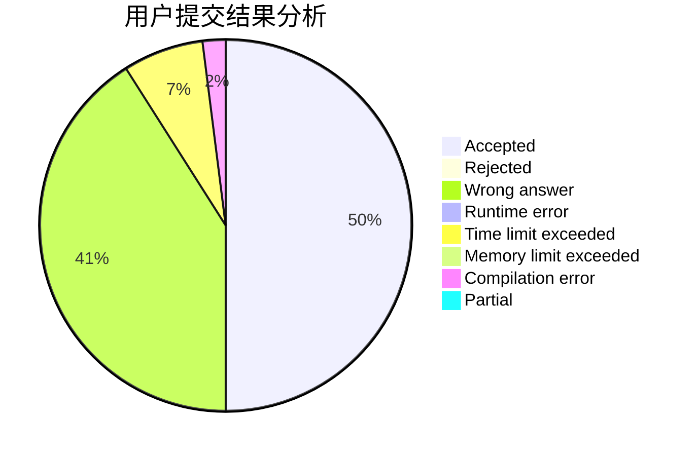
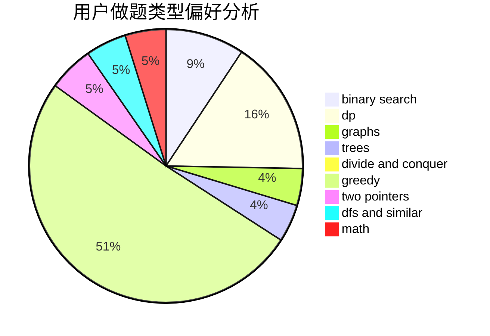

# zexushi

<!-- tabs:start -->

#### **用户提交结果分析**

#### **用户做题类型偏好分析**

<!-- tabs:end -->
# 推荐题目
[14392](https://codeforces.com/contest/1439/problem/2)
[1129D](https://codeforces.com/contest/1129/problem/D)
[1265C](https://codeforces.com/contest/1265/problem/C)
[847E](https://codeforces.com/contest/847/problem/E)
[1220E](https://codeforces.com/contest/1220/problem/E)
[121E](https://codeforces.com/contest/121/problem/E)
[59E](https://codeforces.com/contest/59/problem/E)
[650D](https://codeforces.com/contest/650/problem/D)
[633D](https://codeforces.com/contest/633/problem/D)
[1078D](https://codeforces.com/contest/1078/problem/D)
