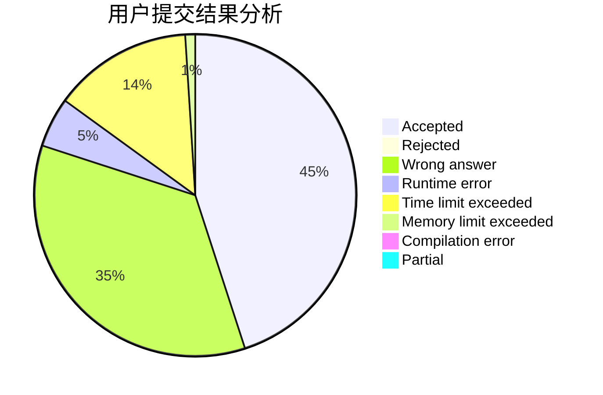
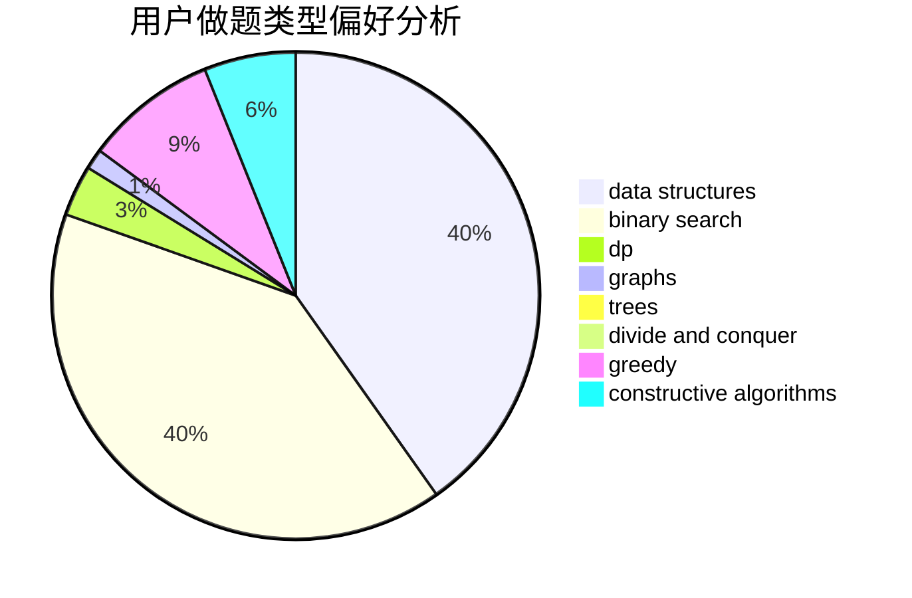
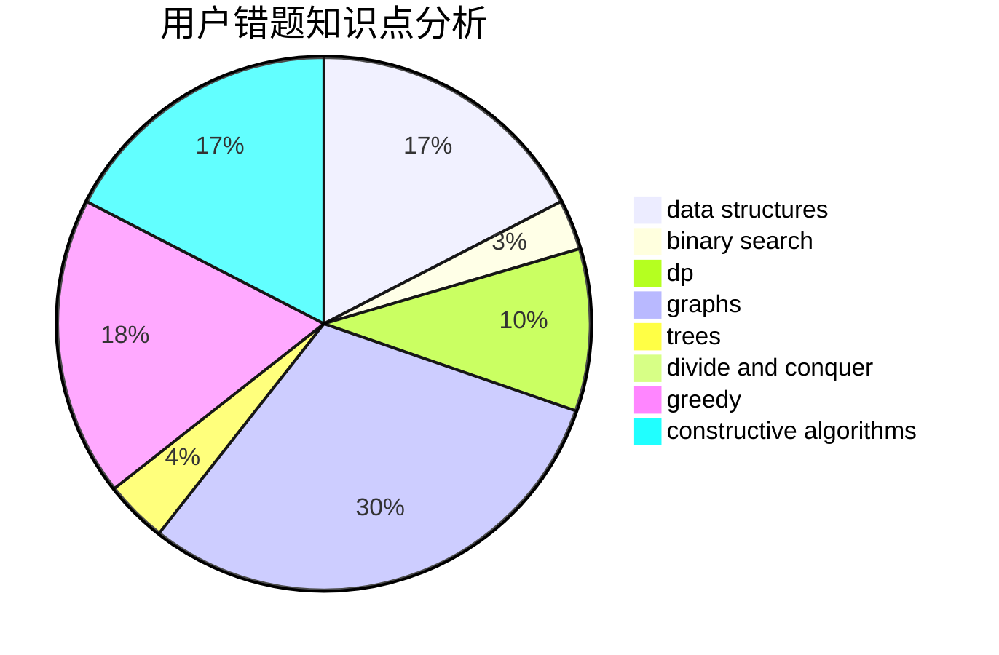

# zfybfq

<!-- tabs:start -->

#### **用户提交结果分析**

#### **用户做题类型偏好分析**

#### **用户错题知识点分析**

<!-- tabs:end -->
# 推荐题目
[723B](https://codeforces.com/contest/723/problem/B)		expression parsing,
                        implementation,
                        strings		  
[1C](https://codeforces.com/contest/1/problem/C)		geometry,
                        math		  
[155A](https://codeforces.com/contest/155/problem/A)		brute force		  
[827B](https://codeforces.com/contest/827/problem/B)		constructive algorithms,
                        greedy,
                        implementation,
                        trees		  
[33D](https://codeforces.com/contest/33/problem/D)		geometry,
                        graphs,
                        shortest paths,
                        sortings		  
[301E](https://codeforces.com/contest/301/problem/E)		dp		  
[602A](https://codeforces.com/contest/602/problem/A)		brute force,
                        implementation		  
[1287C](https://codeforces.com/contest/1287/problem/C)		dsu,graphs,sortings,trees		  
[350B](https://codeforces.com/contest/350/problem/B)		graphs		  
[238C](https://codeforces.com/contest/238/problem/C)		dfs and similar,
                        dp,
                        greedy,
                        trees		  
