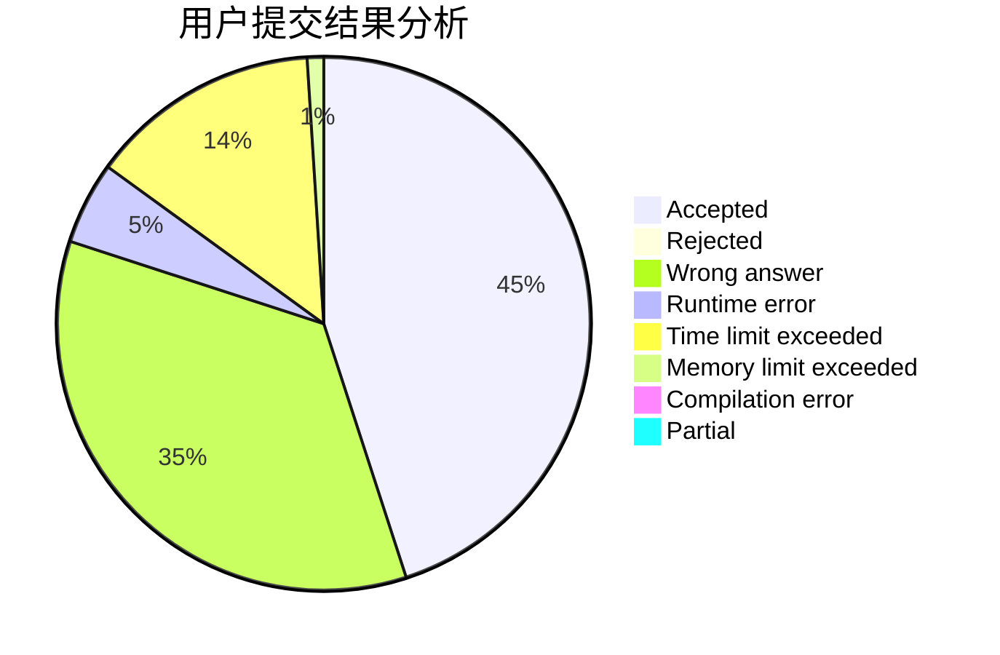
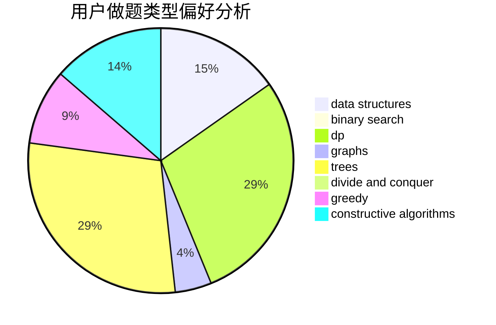
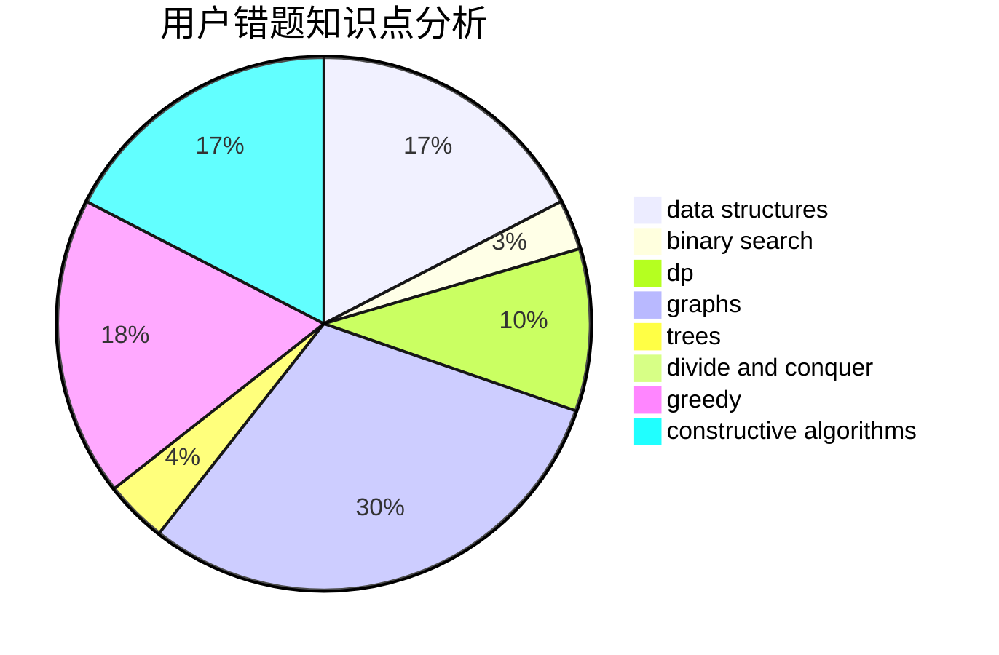

# zfybfq

<!-- tabs:start -->

#### **用户提交结果分析**

#### **用户做题类型偏好分析**

#### **用户错题知识点分析**

<!-- tabs:end -->
# 推荐题目
[740A](https://codeforces.com/contest/740/problem/A)		brute force,
                        implementation		  
[224B](https://codeforces.com/contest/224/problem/B)		bitmasks,
                        implementation,
                        two pointers		  
[176D](https://codeforces.com/contest/176/problem/D)		dp		  
[845E](https://codeforces.com/contest/845/problem/E)		binary search,
                        data structures		  
[367D](https://codeforces.com/contest/367/problem/D)		bitmasks,
                        dfs and similar		  
[321A](https://codeforces.com/contest/321/problem/A)		binary search,
                        implementation,
                        math		  
[621B](https://codeforces.com/contest/621/problem/B)		combinatorics,
                        implementation		  
[1294F](https://codeforces.com/contest/1294/problem/F)		dfs and similar,
                        dp,
                        greedy,
                        trees		  
[377C](https://codeforces.com/contest/377/problem/C)		bitmasks,
                        dp,
                        games		  
[25E](https://codeforces.com/contest/25/problem/E)		hashing,
                        strings		  
