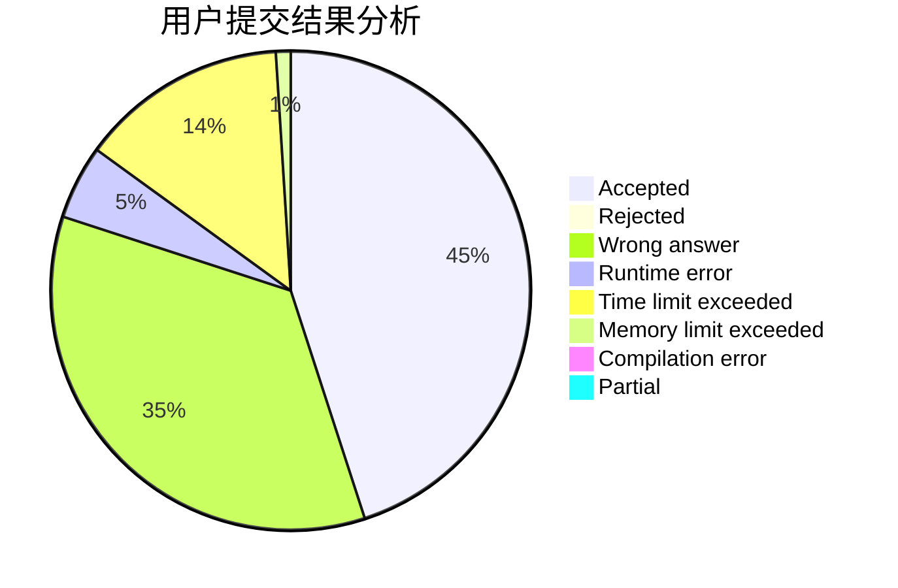
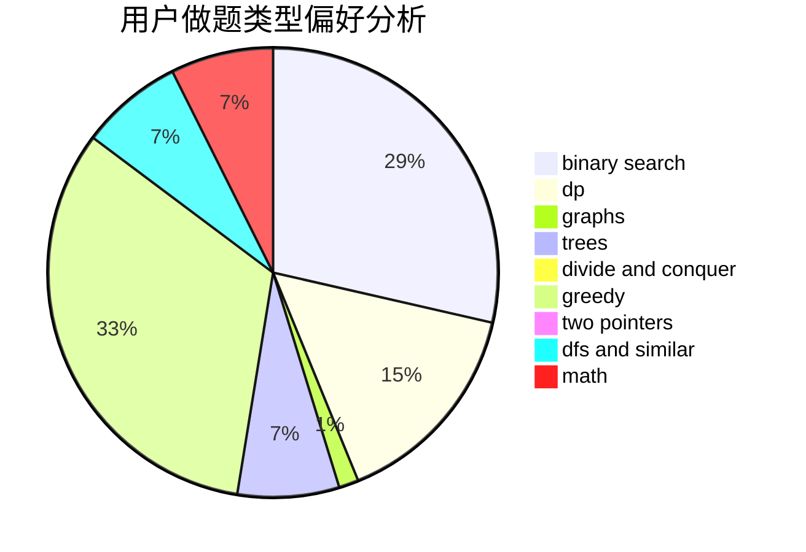

# zfybfq

<!-- tabs:start -->

#### **用户提交结果分析**

#### **用户做题类型偏好分析**

<!-- tabs:end -->
# 推荐题目
[740A](https://codeforces.com/contest/740/problem/A)
[224B](https://codeforces.com/contest/224/problem/B)
[176D](https://codeforces.com/contest/176/problem/D)
[845E](https://codeforces.com/contest/845/problem/E)
[367D](https://codeforces.com/contest/367/problem/D)
[321A](https://codeforces.com/contest/321/problem/A)
[621B](https://codeforces.com/contest/621/problem/B)
[1294F](https://codeforces.com/contest/1294/problem/F)
[377C](https://codeforces.com/contest/377/problem/C)
[25E](https://codeforces.com/contest/25/problem/E)
